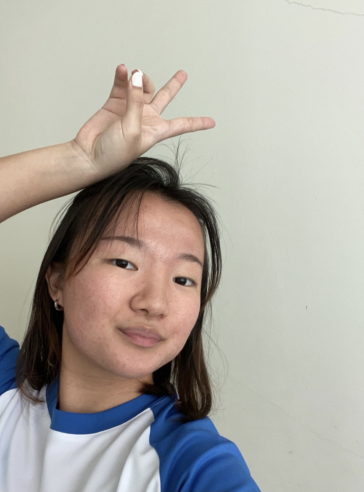

We are a team based in the [School of Computing, National University of Singapore](http://www.comp.nus.edu.sg).

## Project team

### CraveToCode

[[github](http://github.com/CraveToCode)]
[[portfolio](team/cravetocode.md)]

* Role: Developer
* Responsibilities: Code Quality, Integration, Scheduling and Tracking

### Xiong Jingya

[[github](http://github.com/xiongjya)] [[portfolio](team/xiongjya.md)]

* Role: Developer
* Responsibilities: Code quality, Documentation, UI

### Tan Sze Ying

[[github](http://github.com/tsy24)]
[[portfolio](team/tsy24.md)]

* Role: Developer
* Responsibilities: Deliverables and deadlines, Testing

### Ng Tze Henn

[[github](http://github.com/Superbestron)]
[[portfolio](team/superbestron.md)]

* Role: Developer
* Responsibilities: Integration, Scheduling and Tracking

### Luo Siyi

[[github](http://github.com/nicole-luo-exe)]
[[portfolio](team/nicole-luo-exe.md)]

* Role: Developer
* Responsibilities:  Code Quality, Documentation, Integration, Testing
