* Table of Contents
{:toc}

--------------------------------------------------------------------------------------------------------------------

## **Acknowledgements**

* [JavaFX](https://openjfx.io/)
* [Jackson](https://github.com/FasterXML/jackson)
* [JUnit5](https://github.com/junit-team/junit5)
* [Address Book Level 4](https://github.com/se-edu/addressbook-level4)

--------------------------------------------------------------------------------------------------------------------

## **Setting up, getting started**

Refer to the guide [_Setting up and getting started_](SettingUp.md).

--------------------------------------------------------------------------------------------------------------------

## **Design**

<div markdown="span" class="alert alert-primary">

:bulb: **Tip:** The `.puml` files used to create diagrams in this document can be found in the [diagrams](https://github.com/AY2122S1-CS2103T-F13-2/tp/tree/master/docs/diagrams) folder. 
Refer to the [_PlantUML Tutorial_ at se-edu/guides](https://se-education.org/guides/tutorials/plantUml.html) to learn how to create and edit diagrams.
</div>

### Architecture

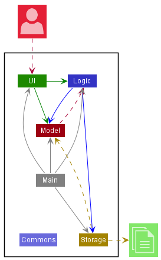

The ***Architecture Diagram*** given above explains the high-level design of the App. Given below is a quick overview of main components and how they interact with each other.

**Main components of the architecture**

**`Main`** has two classes called [`Main`](https://github.com/AY2122S1-CS2103T-F13-2/tp/blob/master/src/main/java/nurseybook/Main.java) and [`MainApp`](https://github.com/AY2122S1-CS2103T-F13-2/tp/blob/master/src/main/java/nurseybook/MainApp.java). It is responsible for,
* At app launch: Initializes the components in the correct sequence, and connects them up with each other.
* At shut down: Shuts down the components and invokes cleanup methods where necessary.

[**`Commons`**](#common-classes) represents a collection of classes used by multiple other components.

The rest of the App consists of four components.

* [**`UI`**](#ui-component): The UI of the App.
* [**`Logic`**](#logic-component): The command executor.
* [**`Model`**](#model-component): Holds the data of the App in memory.
* [**`Storage`**](#storage-component): Reads data from, and writes data to, the hard disk.


**How the architecture components interact with each other**

The *Sequence Diagram* below shows how the components interact with each other for the scenario where the user issues the command `deleteElderly 1`.

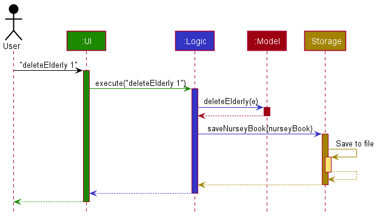

Each of the four main components (also shown in the diagram above),

* defines its *API* in an `interface` with the same name as the Component.
* implements its functionality using a concrete `{Component Name}Manager` class which follows the corresponding API `interface` mentioned in the previous point.

For example, the `Logic` component defines its API in the `Logic.java` interface and implements its functionality using the `LogicManager.java` class which follows the `Logic` interface. Other components interact with a given component through its interface rather than the concrete class (reason: to prevent outside component's being coupled to the implementation of a component), as illustrated in the (partial) class diagram below.


The sections below give more details of each component.

### UI component

The **API** of this component is specified in [`Ui.java`](https://github.com/AY2122S1-CS2103T-F13-2/tp/blob/master/src/main/java/nurseybook/ui/Ui.java)

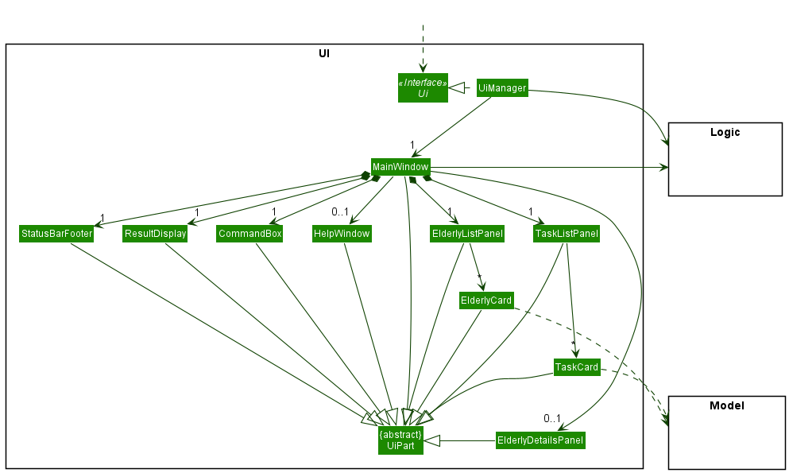

The UI consists of a `MainWindow` that is made up of parts e.g.`CommandBox`, `ResultDisplay`, `ElderlyListPanel`, `StatusBarFooter` etc. All these, including the `MainWindow`, inherit from the abstract `UiPart` class which captures the commonalities between classes that represent parts of the visible GUI.

The `UI` component uses the JavaFx UI framework. The layout of these UI parts are defined in matching `.fxml` files that are in the `src/main/resources/view` folder. For example, the layout of the [`MainWindow`](https://github.com/AY2122S1-CS2103T-F13-2/tp/blob/master/src/main/java/nurseybook/ui/MainWindow.java) is specified in [`MainWindow.fxml`](https://github.com/se-edu/AY2122S1-CS2103T-F13-2/tp/tree/master/src/main/resources/view/MainWindow.fxml)

The `UI` component,

* executes user commands using the `Logic` component.
* listens for changes to `Model` data so that the UI can be updated with the modified data.
* keeps a reference to the `Logic` component, because the `UI` relies on the `Logic` to execute commands.
* depends on some classes in the `Model` component, as it displays `Elderly` object residing in the `Model`.

### Logic component

**API** : [`Logic.java`](https://github.com/AY2122S1-CS2103T-F13-2/tp/blob/master/src/main/java/nurseybook/logic/Logic.java)

Here's a (partial) class diagram of the `Logic` component:


How the `Logic` component works:
1. When `Logic` is called upon to execute a command, it uses the `NurseyBookParser` class to parse the user command.
1. This results in a `Command` object (more precisely, an object of one of its subclasses e.g., `AddCommand`) which is executed by the `LogicManager`.
1. The command can communicate with the `Model` when it is executed (e.g. to add an elderly).
1. The result of the command execution is encapsulated as a `CommandResult` object which is returned from `Logic`.

The Sequence Diagram below illustrates the interactions within the `Logic` component for the `execute("deleteElderly 1")` API call.


<div markdown="span" class="alert alert-info">:information_source: **Note:** The lifeline for `DeleteCommandParser` should end at the destroy marker (X) but due to a limitation of PlantUML, the lifeline reaches the end of diagram.
</div>

Here are the other classes in `Logic` (omitted from the class diagram above) that are used for parsing a user command:

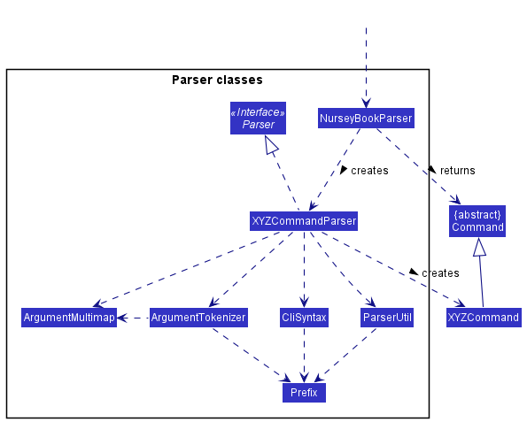

How the parsing works:
* When called upon to parse a user command, the `NurseyBookParser` class creates an `XYZCommandParser` (`XYZ` is a placeholder for the specific command name e.g., `AddCommandParser`) which uses the other classes shown above to parse the user command and create a `XYZCommand` object (e.g., `AddCommand`) which the `NurseyBookParser` returns back as a `Command` object.
* All `XYZCommandParser` classes (e.g., `AddCommandParser`, `DeleteCommandParser`, ...) inherit from the `Parser` interface so that they can be treated similarly where possible e.g, during testing.

### Model component
**API** : [`Model.java`](https://github.com/AY2122S1-CS2103T-F13-2/tp/blob/master/src/main/java/nurseybook/model/Model.java)

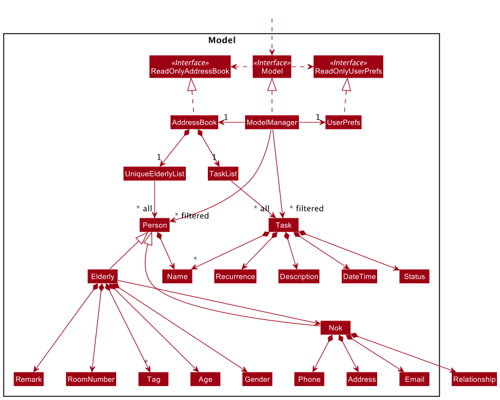


The `Model` component,

* stores the nursey book data i.e., all `Elderly` objects (which are contained in a `UniqueElderlyList` object) and all `Task` objects (which are contained in a `UniqueTaskList` object).
* stores the currently 'selected' `Elderly` objects (e.g., results of a search query) as a separate _filtered_ list which is exposed to outsiders as an unmodifiable `ObservableList<Elderly>` that can be 'observed' e.g. the UI can be bound to this list so that the UI automatically updates when the data in the list change.
* stores the currently 'selected' `Task` objects in a similar way to `Elderly` objects which is also exposed to outsiders as an unmodifiable `ObservableList<Task>`.
* stores a `UserPref` object that represents the user’s preferences. This is exposed to the outside as a `ReadOnlyUserPref` objects.
* stores the states of the nursey book after the execution of commands that change the data in `NurseyBookState` objects.
* depends on some classes in the `Logic` component because the `Model` component saves the result after the execution of commands that change the data of nursey book.
* does not depend on the `Storage` and `Ui` components (as the `Model` represents data entities of the domain, it should make sense on its own without depending on `Storage` and `Ui`)


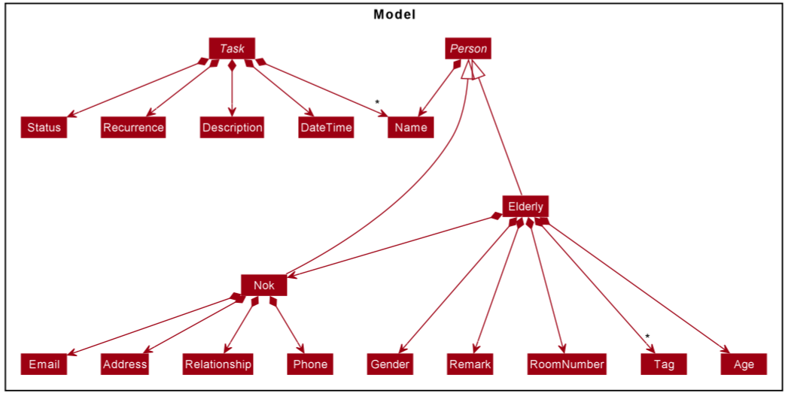 

More details regarding `Person`, `Elderly`, `Nok`(Next of kin) and `Task` objects.

### Storage component

**API** : [`Storage.java`](https://github.com/AY2122S1-CS2103T-F13-2/tp/blob/master/src/main/java/nurseybook/storage/Storage.java)

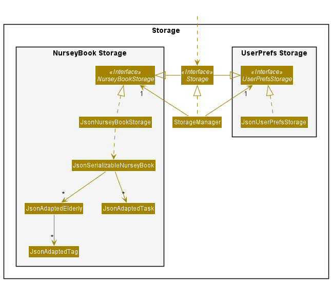

The `Storage` component,
* can save both NurseyBook data and user preference data in json format, and read them back into corresponding objects.
* inherits from both `NurseyBookStorage` and `UserPrefStorage`, which means it can be treated as either one (if only the functionality of only one is needed).
* depends on some classes in the `Model` component (because the `Storage` component's job is to save/retrieve objects that belong to the `Model`)

### Common classes

Classes used by multiple components are in the `nurseybook.commons` package.

--------------------------------------------------------------------------------------------------------------------

## **Implementation**

This section describes some noteworthy details on how certain features are implemented.

### Filter command

#### Implementation
The implementation of the filter command is facilitated by the FilterCommand class and ElderlyHasTagPredicate class.
ElderlyHasTagPredicate contains a set of tags that was queried in the filter command and has a method `test`
to test whether an Elderly has all the tags in the set.

Given below is the class diagram of the FilterCommand and the ElderlyHasTagPredicate.

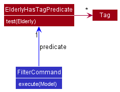

The following sequence diagram shows how the filter command works:

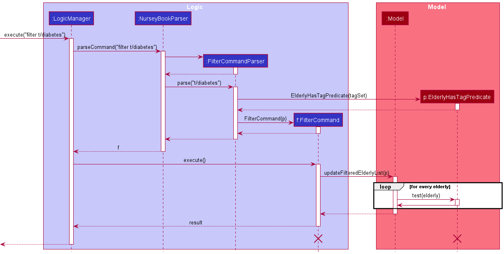
<div markdown="span" class="alert alert-info">:information_source: **Note:** The lifeline for `FilterCommand` and `ElderlyHasTagPredicate` should end at the destroy marker (X) but due to a limitation of PlantUML, the lifeline reaches the end of diagram.

</div>

As tags can only be alphanumeric, the `parse` method in FilterCommandParser checks that the all the tags queried are valid first before creating the FilterCommand and ElderlyHasTagPredicate objects.
If there is a tag that is invalid, an exception will be thrown.

When executing the filter command, the `updateFilteredElderlyList` method of Model calls other methods that are omitted from the diagram.
One of the methods then calls the `test` method of the ElderlyHasTagPredicate object with every Elderly saved in nursey book. The checking for the presence of tags is case-insensitive. 
The list of Elderly that return true for `test` is then assigned to `filteredElderlies` in ModelManager and displayed in the GUI.

#### Design Considerations
**Aspect: How to store tags:** 
* **Alternative 1:** Create a new class TagSet to store tags
    * Pros: Can add custom methods
    * Cons: More code needs to be written and more room for bugs
* **Alternative 2:** Use Java Util Set to store tags
    * Pros: Easy to import and use
    * Cons: Methods that can be used are limited to the methods in Set

**Decision:** Alternative 2 was chosen as the tags are simply kept as a collection.
Only the simple operations such as checking whether a Tag is in the Set and changing the Tags in the set are needed.
Thus, the methods provided in Java Util Set are sufficient and there is no need to implement custom methods.

### Mark a task as done feature

#### How task status is changed
`Task` now contains `Status`, which stores the completion status of the task. `Task` now implements the following operations:

* `Task#markAsDone()` — Sets the task status as done

`TaskList` uses the method above to mark the specified task as done in `TaskList#markTaskAsDone(Task toMark)`. This operation is exposed in the `Model` interface as `Model#markTaskAsDone(Task target)`.

#### How the target task is identified
First, the `DoneTaskCommandParser` parses the `Index` which is passed to the `DoneTaskCommand`.  The `Index` identifies the task to be marked as done.

The following sequence diagram shows how this operation works:

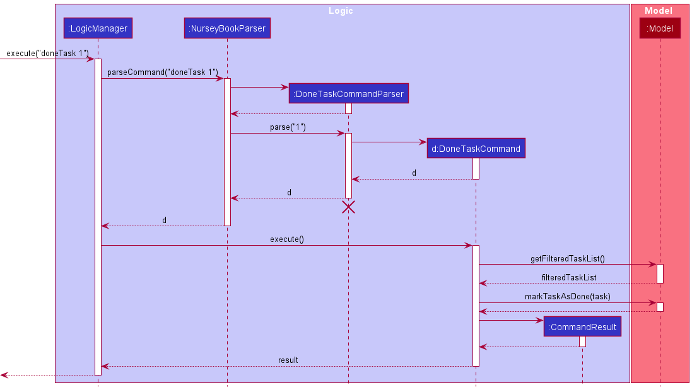

The following activity diagram summarizes what happens when a user enters the command for this feature:

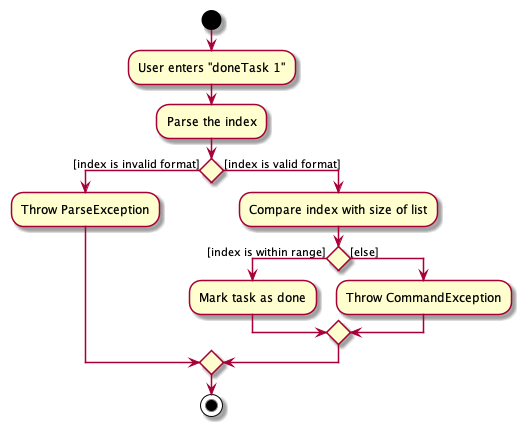

### Add Recurring Task feature

#### Implementation
Task now contains `Recurrence`,  which encapsulates the recurrence type of the task. There are 4 recurrence types:
1. `NONE` -> Non-recurring `Task`
2. `DAY` -> Recurring `Task` that repeats daily
3. `WEEKLY` -> Recurring `Task` that repeats weekly (every 7 days)
4. `MONTHLY` -> Recurring `Task` that repeats every 4 weeks

If a user does not specify `Recurrence` when adding a new `Task`, it will default to a `NONE` `Recurrence` type.

#### Design considerations
##### Aspect: When should the task date be changed based on its `Recurrence` type

* Alternative 1: Once a user has marked a recurring `Task` as done, the date of the `Task` will be automatically changed to the next date according to its `Recurrence` type, with its completion status reset to be undone.
    * Pros: User Experience could be more intuitive in the sense that the user can focus on the next deadline rather than the current completed task
    * Cons: There is an increase in coupling between the `Task`’s `Status`, `Recurrence` and `DateTime` because `DateTime` now needs to depend on `Status` and `Recurrence` to decide if its date and time needs to be changed. This can increase bugs and make testing harder, as more functions would have side effects (resetting task’s completion `Status` and updating `Task`’s `DateTime`).

* Alternative 2: Once a `DateTime` of a `Task` has been passed, this will trigger nursey book to update the new `DateTime` of the `Task` according to its `Recurrence` type.
    * Pros: Easier to implement because there is only one condition that needs to be checked (if the `Task`’s `DateTime` is before the current `DateTime`) for the `Task`’s `DateTime` to be updated.
    * Cons: Restricted choice for users who would prefer seeing upcoming tasks to seeing completed tasks.

### Handling of Overdue and Recurring tasks

#### Implementation

The logic for handling overdue and recurring tasks are handled in `ModelManager#updateTasksAccordingToTime()`.

```     java
@Override
    public void updateTasksAccordingToTime() {
        versionedNurseyBook.updateRecurringTasksDate();
        versionedNurseyBook.updateTasksOverdueStatus();
        versionedNurseyBook.reorderTasksChronologically();
    }
```

The implementation of these individual functions `updateRecurringTasksDate()`, `updateTasksOverdueStatus()` and `reorderTasksChronologically()` are listed below.
1. `updateRecurringTasksDate()`
    *  This function checks whether a `Task` is overdue (`Task`'s `DateTime` is before the current `DateTime`) and if it is a recurring task (`Task#isRecurring` is `True`), before updating recurring tasks' DateTime as needed at the current time.
2. `updateTasksOverdueStatus()`
    *  This function first checks for either of 2 cases:
        * Whether it is overdue (`Status#isOverdue` is `True`) and should not be overdue
        * Whether it is not overdue and should be overdue
    *  Then updates overdue statuses accordingly
        * For first case, it marks the task as overdue
        * For second case, it marks the task as not overdue
3. `reorderTasksChronologically()`
    * This function sorts the tasks according to chronological order, whose order might be disrupted due to changes in `DateTime` of tasks due to `updateRecurringTasksDate()`.
    
Listed below are some situations and corresponding implementations where the overdue `Status`, and `DateTime` might be changed based on either a manual edit of the `Task`'s `DateTime` and/or `Recurrence` type, or simply the passing of time.

1. `DateTime` of non-recurring `Task` has passed current `DateTime`
  - Mark `Status#isOverdue` to `True`
2. `DateTime` of recurring `Task` has passed current `DateTime`
  - Update old `DateTime` to new `DateTime` according to its `Recurrence` type.
  - Mark `Status#isDone` to `False`
  - Status#isOverdue remains `False`
3. User edits non-recurring `Task` with a passed `DateTime` to a future `DateTime`
  - Mark `Status#isOverdue` to `False`
4. User edits non-recurring `Task` with a future `DateTime` to a passed `DateTime`
  - Mark `Status#isOverdue` to `True`

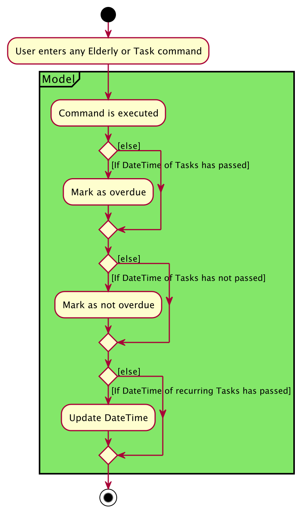

For each `Task` in NurseyBook, it will go through this cycle of checks to ensure their `DateTime` and `Status` are updated accordingly.

### Undo/redo feature

#### Implementation

The undo and redo features are facilitated by `VersionedNurseyBook`. It extends `NurseyBook` with an undo/redo history, stored internally as a `nurseyBookStateList` and `currentStateIndex`. 
The `VersionedNurseyBook` implements the following operations:

* `VersionedNurseyBook#commit()` — Saves the current nursey book state and the latest command result in its history.
* `VersionedNurseyBook#undo()` — Restores the previous nursey book state from its history and returns the command result of the command undone.
* `VersionedNurseyBook#redo()` — Restores a previously undone nursey book state from its history and returns the command result of the command redone.

These operations are exposed in the `Model` interface as `Model#commitNurseyBook()`, `Model#undoNurseyBook()` and `Model#redoNurseyBook()` respectively.

Given below is an example usage scenario and how the undo/redo mechanism behaves at each step.

Step 1. The user launches the application for the first time. The data of the `VersionedNurseyBook` will be initialized with the initial nursey book. 
A new `NurseyBookState` will be created with a copy of the current nursey book and the `INITIAL_COMMAND_RESULT`. 
This initial nursey book state is added to the `nurseyBookStateList`, with the `currentStateIndex` pointing to that initial nursey book state.

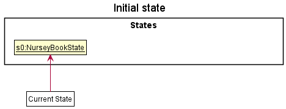

Step 2. The user executes `deleteElderly 5` command to delete the 5th elderly in the nursey book. The `deleteElderly` command calls `Model#commitNurseyBook()`, 
creating a new `NurseyBookState` with a copy of the modified state of the nursey book after the `deleteElderly 5` command executes and the command result of the `deleteElderly 5` command.
This nursey book state is then saved in the `nurseyBookStateList` and the `currentStateIndex` is shifted to the newly inserted nursey book state.

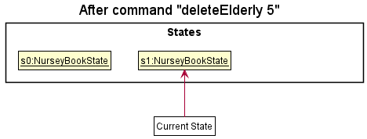

Step 3. The user executes `addTag 1 t/diabetes` to add a tag to the first elderly in the list. The `addTag` command also calls `Model#commitNurseyBook()`, causing another modified nursey book state to be saved into the `nurseyBookStateList`.

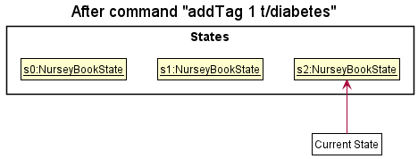

<div markdown="span" class="alert alert-info">:information_source: **Note:** If a command fails its execution, it will not call `Model#commitNurseyBook()`, so the nursey book state will not be saved into the `nurseyBookStateList`.

</div>

Step 4. The user now decides that adding the tag to the elderly was a mistake, and decides to undo that action by executing the `undo` command. 
The `undo` command will call `Model#undoNurseyBook()`, which will decrease the `currentStateIndex` by one, causing it to refer to the previous nursey book state, and restores the nursey book to that state.

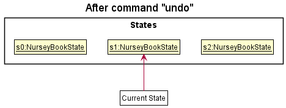

<div markdown="span" class="alert alert-info">:information_source: **Note:** If the `currentStateIndex` is 0, referring to the initial nursey book state, then there are no previous states to restore. 
The `undo` command uses `Model#canUndoNurseyBook()` to check if this is the case. If so, it will return an error to the user rather than attempt to perform the undo.

</div>

The following sequence diagram shows how the undo operation works:

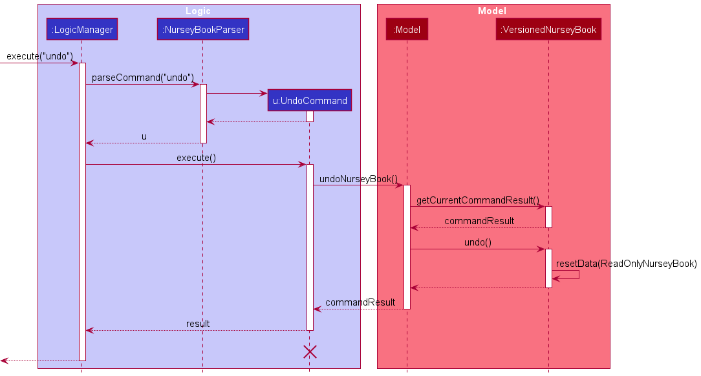

<div markdown="span" class="alert alert-info">:information_source: **Note:** The lifeline for `UndoCommand` should end at the destroy marker (X) but due to a limitation of PlantUML, the lifeline reaches the end of diagram.

</div>

The `redo` command does the opposite — it calls `Model#redoNurseyBook()`, which increases the `currentStateIndex` by one to refer to the previously undone state, and restores the nursey book to that state.

<div markdown="span" class="alert alert-info">:information_source: **Note:** If the `currentStateIndex` is equal to `nurseyBookStateList.size() - 1`, it is referring to the latest nursey book state, then there are no undone nursey book states to restore. 
The `redo` command uses `Model#canRedoNurseyBook()` to check if this is the case. If so, it will return an error to the user rather than attempt to perform the redo.

</div>

Step 5. The user then decides to execute the command `viewElderly`. Commands that do not modify the data of the nursey book, such as `viewElderly`, will not call `Model#commitNurseyBook()`, `Model#undoNurseyBook()` or `Model#redoNurseyBook()`. 
Thus, the `nurseyBookStateList` and `currentStateIndex` remains unchanged.

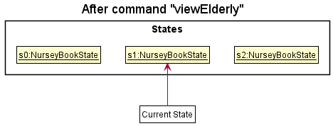

Step 6. The user executes `clear`, which calls `Model#commitNurseyBook()`. Since the `currentStateIndex` is not at the end of the `nurseyBookStateList`, all nursey book states after the `currentStateIndex` will be deleted. 
The new modified nursey book state is then saved into the `nurseyBookStateList`
Reason: It no longer makes sense to redo the `addTag 1 t/diabetes` command. This is the behavior that most modern desktop applications follow.

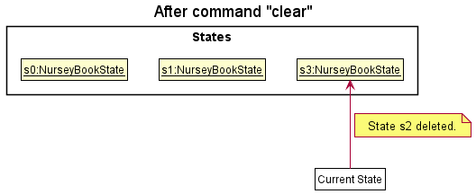

The following activity diagram summarizes what happens when a user executes a new command:

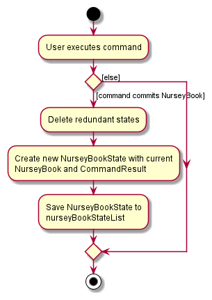

#### Design considerations:

**Aspect: How undo & redo executes:**

* **Alternative 1:** Saves the entire nursey book.
  * Pros: Easy to implement.
  * Cons: May have performance issues in terms of memory usage as copies of the entire nursey book are saved.

* **Alternative 2:** Individual command knows how to undo/redo by itself.
  * Pros: Will use less memory (e.g. for `deleteElderly`, just save the elderly being deleted).
  * Cons: We must ensure that the implementation of each individual command are correct.

**Decision:** Alternative 1 was chosen as there are many commands that change the data of the nursey book. 
With alternative 1, all these commands will go through the same activity of saving the nursey book state instead of having different activity flow for undoing or redoing each command, making it easier to maintain.

**Aspect: What to save:**
* **Alternative 1:** Save only the nursey book.
    * Pros: Easy to implement.
    * Cons: No information on the commands that changed the data of the nursey book.

* **Alternative 2:** Save the nursey book and the command result.
    * Pros: Information on the command that changed the data of the nursey book is saved.
    * Cons: More memory usage as more information needs to be saved and increases dependency between classes.

**Decision:** Alternative 2 was chosen as we feel that it is helpful to store information on the command that changed the data of the nursey book.
This way, when users execute the undo/redo command, information on the command that is being undone/redone is also available and can be shown to the user. 
The relevant user interface is also displayed to the user as the `ListDisplayChange` is in the command result saved. 
For example, when a user undoes an `addElderly` command, the user interface will toggle to the list of elderly based on the command result saved, showing the user the change.

### Delete Nok feature

#### Implementation

The implementation of `DeleteNokCommand` is highly similar to that of `DeleteCommand`. Major differences are in how the steps 5 and 6 below are handled.

Given below is an example usage scenario and how the delete Nok mechanism behaves at each step. The example command is `deleteNok 1`.

Step 1. The user executes `deleteNok 1` command to delete the NoK details of the first elderly in the elderly list. This prompts the `LogicManager` to start its execution by calling its `execute()` command.

Step 2. `LogicManager` calls the `NurseyBookParser` to parse the command.

Step 3. The `NurseyBookParser` creates a new `DeleteNokCommandParser` object and calls its `parse` method to parse the arguments. This creates and returns a new `DeleteNokCommand` which is ready to be executed, containing the index of the target elderly as one of its fields.

Step 4. The `DeleteNokCommand` is executed by calling its `execute()` method. This calls the `Model#getFilteredElderlyList()` and retrieves the filtered elderly list, which should contain all elderlies.

Step 5. A new updated Elderly object is created with all fields equivalent to the targeted Elderly object, apart from the Nok fields which are wiped. This process has been omitted from the sequence diagram below.

Step 6. The `Model#setElderly()` method is then called to replace the targeted Elderly with the updated Elderly object.

Step 7. A new `CommandResult` is returned which contains the details of the new Elderly object. The result is returned to `LogicManager`.

The following sequence diagram shows how the find task operation works:

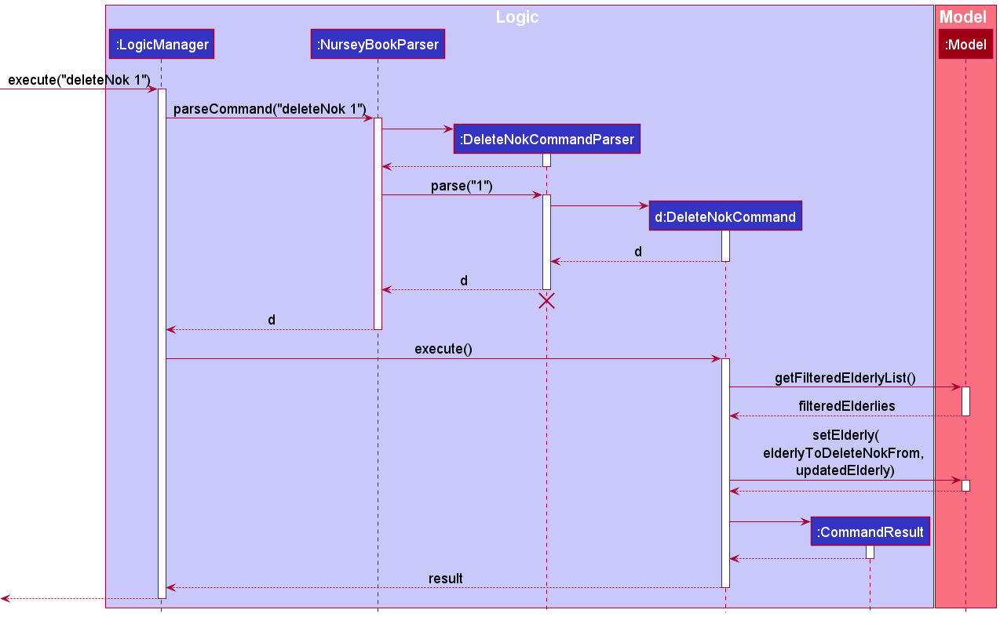

<div markdown="span" class="alert alert-info">:information_source: **Note:** The lifeline for `DeleteNokCommandParser` should end at the destroy marker (X) but due to a limitation of PlantUML, the lifeline reaches the end of diagram.

</div>

### Find task feature

#### Implementation

These operations are exposed in the `Model` interface as `Model#updateFilteredTaskList(predicate)`.

Given below is an example usage scenario and how the find task mechanism behaves at each step. The example command is `findTask Pfizer`.

Step 1. The user launches the application and executes `findTask Pfizer` command to search for a list of tasks whose `Description` contains the keyword `Pfizer`. This prompts the `LogicManager` to start its execution by calling its `execute()` command.

Step 2. `LogicManager` calls the `NurseyBookParser` to parse the command.

Step 3. The `NurseyBookParser` creates a new `FindCommandParser` which will `parse()` the arguments. This creates a new `DescriptionContainsKeywordPredicate` that checks if a `Task`'s `Description` contains the keyword(s) - `Pfizer` in this case. A new `FindTaskCommand` which is ready to be executed is returned, containing the predicate as one of its fields.

Step 4. The `FindTaskCommand` is executed by calling its `execute()` method. This calls the `Model#updateFilteredTaskList()` and updates the filtered task list by checking the tasks with `DescriptionContainsKeywordPredicate`.

Step 5. A new `CommandResult` is returned which switches the display to the filtered task list. The result is returned to `LogicManager`.

The following sequence diagram shows how the find task operation works:

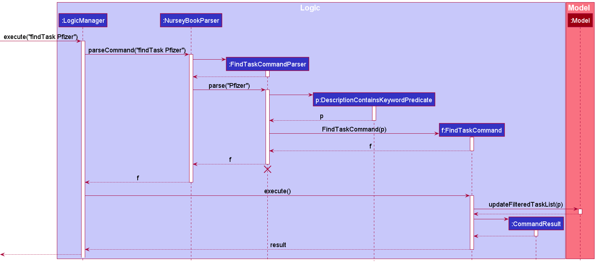

<div markdown="span" class="alert alert-info">:information_source: **Note:** The lifeline for `FindTaskCommandParser` should end at the destroy marker (X) but due to a limitation of PlantUML, the lifeline reaches the end of diagram.

</div>

### ViewElderly and ViewTasks feature

#### How `CommandResult` is changed

As nursey book has to support the display of two different lists (contacts vs task), each `CommandResult` object will now store the information which list should be displayed to the user.

The following class diagram shows the changes made to the `CommandResult` class. Each `CommandResult` has an enum that specifies the type of display.

* `CommandResult#ListDisplayChange.ELDERLY` — Specifies the elderly list to be displayed after the current command execution
* `CommandResult#ListDisplayChange.TASK` — Specifies the task list to be displayed after the current command execution
* `CommandResult#ListDisplayChange.NONE` — Specifies the type of displayed list should not change after the current command execution

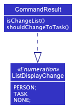

#### How `MainWindow` processes `CommandResult`

`MainWindow#handleChange()` is a new method that handles the switching of the list display. It checks if a `CommandResult` object specifies the change of list display, and changes the UI accordingly.

#### Execution

Given below is an example usage scenario and how the display of elderly/task list mechanism behaves at each step. An example command is `viewElderly`, and the mechanism of `viewTasks` is similar.

Step 1. The user launches the application for the first time. The default display of nursey book shows the list of all elderly that were added in.

Step 2. The user runs a few other available commands, and wants to switch back to the default display with the elderly, thus executes the `viewElderly` command.

Step 3. `MainWindow#executeCommand("viewElderly")` is called. Within the method body, it calls the `LogicManager#execute()` which returns a new `CommandResult`.

Step 4. `MainWindow#executeCommand()` processes the `CommandResult`. It calls `MainWindow#handleChange()` to change the display of the list, to show all elderly.

The following activity diagram summarizes what happens in the `MainWindow` class when the user enters either the `viewElderly` or `viewTasks` command.

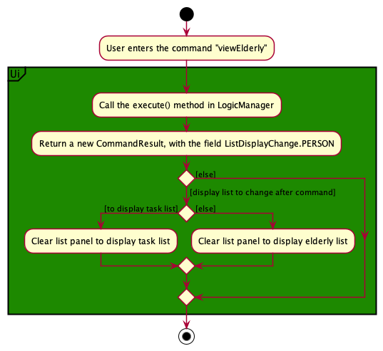

#### Design considerations:

**Aspect: How to display elderlies and tasks separately**
* **Alternative 1 (current choice):** Using a commands `viewElderly` and `viewTasks`, switch the display in the main window between the elderly list and task list stored in `NurseyBook`.
  * Pros: Cleaner display, able to display the necessary information without cluttering the display window
  * Cons: The need to implement two new commands, `viewElderly` and `viewTask` for the user to view the two lists respectively. The code for the two commands might contain repetition due to the similarity in function.


* **Alternative 2:** Display the list of elderly and list of tasks side by side in the same display window.
  * Pros: Implementation/Creation of new commands are not needed. The user is able to type less yet still view what he/she is interested in.
  * Cons: With two different lists (that contain different objects) displayed side by side, the display might seem cluttered and hard to read from. It negatively impacts the user experience.
  

### ViewSchedule Feature

#### Implications on representation of `Task` objects
The `viewSchedule` command introduced a need for certain tasks, specifically future occurrences of recurring tasks, to be visible to the user only when this command is called. Such temporary tasks need to be not visible once the next command is entered.

To achieve this functionality, `Task` objects had to be refactored into`RealTask` and `GhostTask` objects as shown in the diagram below.

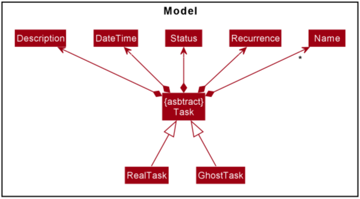

RealTasks represent concrete tasks, which are either non-recurring tasks, or the current occurrence of recurring tasks.
GhostTasks are temporary tasks that exist for the purpose of allowing the user to preview future occurrences of recurring tasks.
By default, `viewTasks` will only show RealTasks.


Since `UniqueTaskList` contains `Task` objects, it can be either `GhostTask` or `RealTask` objects. 
Naturally, this implies that calling two `viewSchedule` commands which both create GhostTasks, one after another, would cause the latter `viewSchedule` command to incorrectly display the GhostTasks created by the former, since all GhostTasks would  persist in the main `UniqueTaskList`. 
Such a problem can also be extended to any future new commands implemented, which create and display GhostTasks.
This necessitates a cleanup of `GhostTask` objects between execution of each command. Such deletion of old GhostTasks in the `Model` is achieved just prior to the execution of each new command in `LogicManager`, via the `deleteGhostTasks()` method.

Code snippet of the `execute(String commandText)` method in `LogicManager`:
```
@Override
public CommandResult execute(String commandText) throws CommandException, ParseException {
    logger.info("----------------[USER COMMAND][" + commandText + "]");
    
    //deletes all previous ghost tasks from the model as they are no longer relevant
    model.deleteGhostTasks();
    
    //parsing and execution of command
    CommandResult commandResult;
    Command command = nurseyBookParser.parseCommand(commandText);
    commandResult = command.execute(model);
```


#### Implementation of ViewSchedule

`ViewScheduleCommand` leverages on this ability to create GhostTasks. The other unique aspect in the implementation of this feature, is how the program figures out which GhostTasks to create and show to the user upon execution of this command.
When a `ViewScheduleCommand` is executed with a given `keyDate`, where `keyDate` refers to the date on which the user wants to view schedule, `addPossibleGhostTasksWithMatchingDate(keyDate)` is responsible for this addition of relevant GhostTasks.

Each task in the task list goes through a series of checks and actions before a GhostTask is created. 
Given below is an activity diagram that summarizes the sequence of checks and actions taken for each task in the task list upon calling the above-mentioned method.

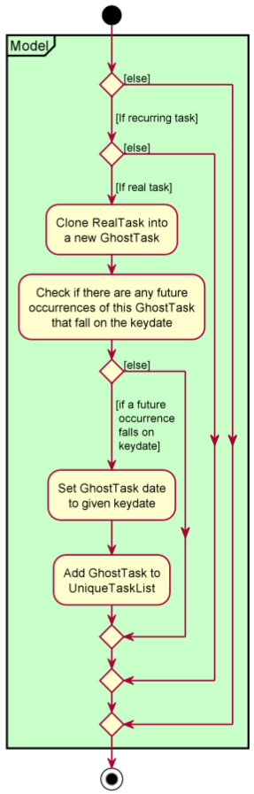

Since the remaining general mechanisms by which the view schedule operation occurs, such as how the command is parsed and how the `ViewScheduleCommand` is created,  is similar to other previously elaborated commands, a step-by-step elaboration is not given for the overall execution.

<br>

#### Design Considerations
**Aspect: Differentiating `RealTask` and `GhostTask` Objects:**
* **Alternative 1:** Add a new field to `Task` objects that determine whether a task is a real task or not.
    * Pros: Easier to implement and integrate with existing AB3 code
    * Cons: Increased failure points, as an additional field has to be stored in the hard disk to determine if tasks are real or not. This field has to be kept track of in between different commands, but not exposed to the user.
* **Alternative 2:** Make `Task` abstract and add concrete `RealTask` and `GhostTask` subclasses to it.
    * Pros: Clearer classification of Task types. Polymorphism can be used to handle `RealTask` and `GhostTask` objects respectively.
    * Cons: All code for existing `Task` objects needs to be refactored. More code needs to be written, which could result in more room for bugs.

**Decision:**
Alternative 2 was chosen as although Alternative 1 is simpler to implement, Alternative 1 has poor encapsulation of real and temporary task objects. `GhostTasks` need to be handled differently
from `RealTasks`, as we do not want to expose them to the user. Hence, it makes more sense to encapsulate it as a separate class, even though more code needs to be refactored, written and tested.
This also keeps the data stored in the hard disk smaller, as there is no unnecessary field to keep track of whether a task is real or not.

<br>

**Aspect: Searching of future occurrences of recurring tasks:**
With recurring tasks, they imply the existence of infinite potential future occurrences. Consequently, users could input dates well beyond reasonable amounts, such as centuries into
the future. However, it is not sensible nor feasible to search for such extraneous lengths of time. Hence, the maximum amount of time that a user can view schedule on a future date has been
capped at 12 weeks, or 84 days, from the current date. This number was derived based on our estimations on how many weeks nurses would most likely have to plan ahead for in nursing homes, along with some extra leeway.

<br>

**Aspect: Viewing of schedule on dates that have passed already:**
For viewing schedule on a date that has passed already, there is no issue if the tasks that fall on the date are only non-recurring. The complication arises when recurring tasks are involved.
If we were to potentially implement checking of recurring tasks into the past, that would raise concerns such as whether the task should be marked as overdue or not, and whether it should be marked
as done. Due to too much ambiguity involving the representation of recurring tasks in the past, we have decided to disable the option to view schedule of past dates entirely. In any case,
it does not have much value for the context of NurseyBook's purposes as well.


--------------------------------------------------------------------------------------------------------------------

## **Documentation, logging, testing, configuration, dev-ops**

* [Documentation guide](Documentation.md)
* [Testing guide](Testing.md)
* [Logging guide](Logging.md)
* [Configuration guide](Configuration.md)
* [DevOps guide](DevOps.md)

--------------------------------------------------------------------------------------------------------------------

## **Appendix: Requirements**

### Product scope

**Target user profile**:

* has a need to take care of many elderly with various medical needs
* has access to a desktop (at work)
* can type fast
* prefers typing to mouse interactions
* is reasonably comfortable using CLI apps

**Value proposition**: manage elderly details and tasks faster than a typical mouse/GUI driven application


### User stories

Priorities: High (must have) - `* * *`, Medium (nice to have) - `* *`, Low (unlikely to have) - `*`

| Priority | As a …​                  | I want to …​                                               | So that I can…​                                                                                                                               |
| -------- | ----------------------------| ------------------------------------------------------------- | -------------------------------------------------------------------------------------------------------------------------------------------------|
| `* * *`  | nurse                       | add a new elderly to the app                                  | search for his records in the future                                                                                                             |
| `* * *`  | nurse                       | delete details/records of an elderly                          | remove incorrect entries                                                                                                                         |
| `* * *`  | nurse                       | update the records of an elderly                              | the records are up to date without the need to delete and re-add the details                                                                     |
| `* * *`  | nurse                       | add additional notes about an elderly                         | I can understand the elderly under my care better                                                                                                |
| `* *`    | nurse                       | archive the details of elderlies                              | not clutter the system with the details of elderlies who have left the nursing home, but still keep the records of their stay for legal purposes |
| `* * *`  | nurse                       | delete the next-of-kin information of an elderly              | easily delete the next-of-kin information of an elderly that is no longer relevant                                                               |
| `* * *`  | nurse	                     | add tags of conditions of elderly                             | identify the conditions of elderly easily at a glance                                                                                            |
| `* * *`  | nurse	                     | delete tags of conditions of elderly                          | remove tags that are no longer relevant                                                                                                          |
| `* * *`  | nurse	                     | filter the elderly by their tags                              | filter elderly more easily, and plan group activities efficiently, such as ordering food for patients with diabetes                              |
| `* * *`  | nurse                       | view all the elderly I am in charge of/added into NurseyBook  | have a full list of elderly for easy reference                                                                                                   |
| `* * *`  | nurse                       | view the details of each elderly individually                 | find the relevant information of a particular elderly without being cluttered by the details                                                     |
| `* *`    | nurse with a new assignment | view the picture of my new assignment                         | know who I am taking care of                                                                                                                     |
| `* *`    | nurse                       | easily search for an elderly by his/her name                  | get their details and contact their guardian quickly during emergencies                                                                          |
| `* * *`  | nurse                       | add a one-off task                                            | keep track of what I have to do                                                                                                                  |
| `* * *`  | nurse                       | add a recurring task                                          | receive reminders for tasks regularly without having to re-add them each time                                                                    |
| `* * *`  | nurse                       | delete a task                                                 | have a cleaner workspace                                                                                                                         |
| `* * *`  | nurse                       | edit a task                                                   | receive reminders for tasks that are up-to-date                                                                                                  |
| `* * *`  | nurse                       | mark a task as completed                                      | stop receiving reminders that are no longer relevant                                                                                             |
| `* * *`  | forgetful/busy nurse        | get reminders of medical needs of those under my care         | ensure the tasks that I am keeping track of are up-to-date                                                                                       |
| `* * *`  | nurse                       | view overdue tasks                                            | take note of the tasks that are overdue and try to complete them as soon as possible                                                             |
| `* * *`  | nurse                       | view all tasks                                                | have an overview of all my tasks                                                                                                                 |
| `* * *`  | nurse                       | view tasks based on chronological order                       | know which tasks are my priority (have to be completed sooner)                                                                                   |
| `* * *`  | nurse                       | view my schedule on a particular day                          | make plans for that day in advance                                                                                                               |
| `* * *`  | nurse                       | search a task up by its name                                  | quickly get the details of a task                                                                                                                |
| `* * *`  | careless nurse              | undo my recent actions                                        | revert the database to previous changes in case I make a mistake                                                                                 |
| `* * *`  | careless nurse              | redo previously undone commands                               | reverse the previous `undo` commands and re-execute the actions                                                                                  |
| `* *`    | nurse                       | add a nurse (contact)                                         | reach out to a coworker if I am in need of assistance                                                                                            |
| `* *`    | nurse                       | edit the details of a nurse                                   | update the information relevant to the nurse                                                                                                     |
| `* *`    | nurse                       | delete a nurse                                                | remove records of nurses who are no longer relevant to me                                                                                        |
| `* *`    | nurse                       | view nurses and elderly in separate sections                  | have better compartmentalization of information                                                                                                  |
| `* * *`  | new user                    | easily clear the information stored in NurseyBook             | set up NurseyBook for use in my next work place (e.g. another ward I am in charge of, or moving to another nursing home)                         |
| `* * *`  | new user                    | easily view the help guide                                    | know more about the product as and when I need to                                                                                                |
| `* *`    | new nurse                   | easily understand how to view necessary information           | not feel overwhelmed and confused                                                                                                                |
| `* `     | nurse                       | color-code my tasks                                           | differentiate between the tasks more easily                                                                                                      |
| `* `     | user                        | alternate between light/dark mode                             | have an aesthetically pleasing UI                                                                                                                |


### Use cases

(For all use cases below, the **System** is the `NurseyBook` the **Actor** is the `User`, and the **Person** is the
`Nurse` unless specified otherwise)

#### Use cases of elderly commands

##### UC1: List elderly
1. User requests to list elderly.
2. NurseyBook shows a list of elderly.

    Use case ends.

**Extensions**
* 1a. User requests to <u>find elderlies with matching keywords(<a href="#uc5-find-an-elderly">UC5</a>)</u>.
* 1b. Users request to <u>list elderly with queried tags (<a href="#uc10-list-elderly-with-queried-tags">UC10</a>)</u>.
* 2a. The list of elderly is empty.

  Use case ends.
* *a. At any time, user requests to <u>view help (<a href="#uc19-viewing-help">UC19</a>)</u>.

##### UC2: Add an elderly

**MSS**

1. User requests to add an elderly.
2. NurseyBook adds the elderly.

   Use case ends.

**Extensions**
* 1a. All required parameter identifiers are present, but entered arguments are invalid.
    * 1a1. NurseyBook shows an error message.

      Use case resumes at step 1.
* 1b. Not all required parameter identifiers are present (e.g. Gender (`g/`) of the elderly is not entered).
    * 1b1. NurseyBook shows an error message.

      Use case resumes at step 1.
* 1c. Additional parameter identifiers that should not be present are entered.
    * 1c1. NurseyBook shows an error message.

      Use case resumes at step 1.
* 1d. An elderly with the same name (inclusive of names in different casing) already exists.
    * 1d1. NurseyBook shows an error message.

      Use case resumes at step 1.
* 2a. User decides to undo the add action.
    * NurseyBook reverses the changes made by the command.

      Use case ends.
* *a. At any time, user requests to <u>view help (<a href="#uc19-viewing-help">UC19</a>)</u>.

##### UC3: Delete an elderly

**MSS**

1. User requests to <u>list elderly (<a href="#uc1-list-elderly">UC1</a>)</u>.
2. User requests to delete a specific elderly in the list based on index.
3. NurseyBook deletes the specified elderly.
4. NurseyBook shows updated list of elderly and command success message.

   Use case ends.

**Extensions**
* 2a. The given index is invalid.
    * 2a1. NurseyBook shows an error message.

      Use case resumes at step 1.
* *a. At any time, user requests to <u>view help (<a href="#uc19-viewing-help">UC19</a>)</u>.

##### UC4: Edit an elderly’s details

**MSS**

1. User requests to <u>list elderly (<a href="#uc1-list-elderly">UC1</a>)</u>.
2. User requests to edit the details of a specific elderly in the list based on index.
3. NurseyBook edits the details for the elderly.
4. NurseyBook shows updated list of elderly and command success message.

   Use case ends.

**Extensions**
* 2a. The given parameter is invalid.
    * 2a1. NurseyBook shows an error message.

      Use case resumes at step 1.

* 2b. There are extra parameters not accepted by the command.
    * 2b1. NurseyBook shows an error message.

      Use case resumes at step 1.
* 2c. The edit does not cause any change in the elderly's details.
    * 2c1. NurseyBook shows an error message.
    
      Use case resumes at step 1.
* 2d. The edited elderly's name already exists in the elderly database. 
    * 2d1. NurseyBook shows an error message.

      Use case resumes at step 1.
* *a. At any time, user requests to <u>view help (<a href="#uc19-viewing-help">UC19</a>)</u>.

##### UC5: Find an elderly

**MSS**

1. User requests to find an elderly based on a few keywords.
2. NurseyBook shows a list of elderly with names that matches the keywords.
   Use case ends.

**Extensions**
* 2a. The list of elderly is empty.

  Use case ends.
* *a. At any time, user requests to <u>view help (<a href="#uc19-viewing-help">UC19</a>)</u>.

##### UC6: View an elderly's details

**MSS**

1. User requests to <u>list elderly (<a href="#uc1-list-elderly">UC1</a>)</u>.
2. User requests to view details of a specific elderly in the list based on index.
3. NurseyBook shows details of selected elderly and command success message.

   Use case ends.

**Extensions**
* 2a. The given index is invalid.
    * 2a1. NurseyBook shows an error message.

      Use case resumes at step 1.
* *a. At any time, user requests to <u>view help (<a href="#uc19-viewing-help">UC19</a>)</u>.

##### UC7: Delete an elderly's Nok details

Similar to <u>deleting an elderly (<a href="#uc3-delete-an-elderly">UC3</a>)</u> but only deleting an elderly's Nok details.

##### UC8: Add tags to an elderly

**MSS**

1. User requests to <u>list elderly (<a href="#uc1-list-elderly">UC1</a>)</u>.
2. User requests to add tag to a specific elderly in the list based on index.
3. NurseyBook adds the tag to the elderly.
4. NurseyBook shows updated list of elderly and command success message.

   Use case ends.

**Extensions**
* 2a. The given parameter is invalid.
    * 2a1. NurseyBook shows an error message.

      Use case resumes at step 1.

* 2b. There are extra parameters not accepted by the command.
    * 2b1. NurseyBook shows an error message.

      Use case resumes at step 1.

* 2c. Tag to add to elderly already exists.
    * 2c1. NurseyBook shows an error message.

      Use case resumes at step 1.
* *a. At any time, user requests to <u>view help (<a href="#uc19-viewing-help">UC19</a>)</u>.

##### UC9: Delete a tag from an elderly

**MSS**

1. User requests to <u>list elderly (<a href="#uc1-list-elderly">UC1</a>)</u>.
2. User requests to delete tag from a specific elderly in the list based on index.
3. NurseyBook deletes the tag from the elderly.
4. NurseyBook shows updated list of elderly and command success message.

   Use case ends.

**Extensions**
* 2a. The given parameter is invalid.
    * 2a1. NurseyBook shows an error message.

      Use case resumes at step 1.

* 2b. There are extra parameters not accepted by the command.
    * 2b1. NurseyBook shows an error message.

      Use case resumes at step 1.

* 2c. Tag to delete from elderly does not exist.
    * 2c1. NurseyBook shows an error message.

      Use case resumes at step 1.
* *a. At any time, user requests to <u>view help (<a href="#uc19-viewing-help">UC19</a>)</u>.

##### UC10: List elderly with queried tags

**MSS**

1. User requests to filter elderly based on queried tags.
2. NurseyBook shows a list of elderly that have all the tags queried.

   Use case ends.

**Extensions**
* 1a. The given tag is invalid.
    * 1a1. NurseyBook shows an error message.

      Use case resumes at step 1.
* 1b. There are extra parameters not accepted by the command.
    * 1b1. NurseyBook shows an error message.

      Use case resumes at step 1.
* 2a. The list of elderly is empty. 

  Use case ends.
* *a. At any time, user requests to <u>view help (<a href="#uc19-viewing-help">UC19</a>)</u>.

##### UC11: Add remark about an elderly

**MSS**

1. User requests to <u>list elderly (<a href="#uc1-list-elderly">UC1</a>)</u>.
2. User requests to add a remark to a specific elderly in the list based on index.
3. NurseyBook adds the remark to the elderly.
4. NurseyBook shows updated list of elderly and command success message.

   Use case ends.

**Extensions**
* 2a. The given parameter is invalid.
    * 2a1. NurseyBook shows an error message.

      Use case resumes at step 1.
* 2b. There are extra parameters not accepted by the command.
    * 2b1. NurseyBook shows an error message.

      Use case resumes at step 1.
* 2c. The edit does not cause any change in elderly's remark.
    * 2c1. NurseyBook shows an error message.

      Use case resumes at step 1.
* *a. At any time, user requests to <u>view help (<a href="#uc19-viewing-help">UC19</a>)</u>.

#### Use cases of task commands

##### UC12: List tasks
1. User requests to list tasks.
2. NurseyBook shows a list of tasks.
   
   Use case ends.

**Extensions**
* 1a. User requests to <u>find tasks with matching keywords(<a href="#uc17-find-a-task">UC17</a>)</u>.
    * 1a1. NurseyBook shows a list of tasks that matches the user's query (by description)

      Use case ends.

* 2a. The list of tasks is empty.

  Use case ends.
* *a. At any time, user requests to <u>view help (<a href="#uc19-viewing-help">UC19</a>)</u>.

##### UC13: Add a task

Similar to <u>adding an elderly (<a href="#uc2-add-an-elderly">UC2</a>)</u> but adding a task instead. A task takes in different parameters from adding an elderly.

##### UC14: Delete a task

**MSS**

1. User requests to <u>list tasks (<a href="#uc12-list-tasks">UC12</a>)</u>.
2. User requests to delete a specific task in the list based on index.
3. NurseyBook deletes the specified task.
4. NurseyBook shows updated list of tasks and command success message.

    Use case ends.

**Extensions**
* 2a. The given index is invalid.
    * 2a1. NurseyBook shows an error message.

      Use case resumes at step 1.
* *a. At any time, user requests to <u>view help (<a href="#uc19-viewing-help">UC19</a>)</u>.

##### UC15: Edit a task's details

**MSS**

1. User requests to <u>list tasks (<a href="#uc12-list-tasks">UC12</a>)</u>.
2. User requests to edit the details of a specific task in the list based on index.
3. NurseyBook edits the details for the task.
4. NurseyBook shows updated list of task and command success message.

   Use case ends.

**Extensions**
* 2a. The given parameter is invalid.
    * 2a1. NurseyBook shows an error message.

      Use case resumes at step 1.

* 2b. There are extra parameters not accepted by the command.
    * 2b1. NurseyBook shows an error message.

      Use case resumes at step 1.
    
* 2c. The edit does not cause any change in task's details.
    * 2c1. NurseyBook shows an error message.

      Use case resumes at step 1.

* 2d. The task with the same details already exists in the task database.
    * 2d1. NurseyBook shows an error message.

      Use case resumes at step 1.
    
* 2e. For a recurring task, the new edited date and time is before the current date and time.
    * 2e1. NurseyBook shows an error message.

      Use case resumes at step 1.
* *a. At any time, user requests to <u>view help (<a href="#uc19-viewing-help">UC19</a>)</u>.

##### UC16: Mark a task as complete

Similar to <u>deleting a task (<a href="#uc14-delete-a-task">UC14</a>)</u> but marking a task as done instead. The `doneTask` command success message will appear instead.

##### UC17: Find a task

Similar to <u>finding an elderly (<a href="#uc5-find-an-elderly">UC5</a>)</u> but finding a task instead. A task will be shown (as part of the filtered task list) if its description contains the entered keywords.

##### UC18: View the schedule on a day

**MSS**

1. User requests to view his/her schedule on a date.
2. NurseyBook shows the list of tasks scheduled to happen on the date.

   Use case ends.

**Extensions**
* 1a. The given date is in an invalid format.
    * 1a1. NurseyBook shows an error message.

      Use case resumes at step 1.
* 2a. There are no tasks scheduled on that date.

  Use case ends.
* *a. At any time, user requests to <u>view help (<a href="#uc19-viewing-help">UC19</a>)</u>.

#### Use cases of miscellaneous commands

##### UC19: Viewing help

**MSS**

1. User requests for help.
2. NurseyBook opens a new window that contains a summary of the commands as well as a link to the online user guide.

   Use case ends.

##### UC20: Undo a previous command

**MSS**
1. User requests to undo a previous command.
2. NurseyBook undoes the command and display the command success message.
   
    Use case ends.

**Extensions**
* 1a. There are no previous commands to be undone.
  * 1a1. NurseyBook shows an error message.

    Use case ends.
* *a. At any time, user requests to <u>view help (<a href="#uc19-viewing-help">UC19</a>)</u>.

##### UC21: Redo a previously undone command

**MSS**
1. User requests to redo a previous undone command.
2. NurseyBook undoes the command and display the command success message.

   Use case ends.

**Extensions**
* 1a. There are no commands that were undone.
    * 1a1. NurseyBook shows an error message.

      Use case ends.
* *a. At any time, user requests to <u>view help (<a href="#uc19-viewing-help">UC19</a>)</u>.

### Non-Functional Requirements

1.  Should work on any _mainstream OS_ as long as it has Java `11` or above installed.
2.  Should be able to hold up to 1000 elderlies and 1000 tasks without a noticeable sluggishness in performance for typical usage.
3.  A user with above average typing speed for regular English text (i.e. not code, not system admin commands) should be able to accomplish most of the tasks faster using commands than using the mouse.
4.  Data should be stored locally and without any DBMS.
5.  Should be for a single user, not multiple users.
6.  The system should respond within 2 seconds per search query.

### Glossary

* **DBMS**: Database management systems are software systems used to store, retrieve, and run queries on data.
* **Mainstream OS**: Mainstream operating systems such as Windows, Linux, Unix, OS-X.
* **Private contact detail**: A contact detail that is not meant to be shared with others.
* **CLI**: Command line interface where users interact with the system by typing in commands.
* **GUI driven application**: Graphical user interface where users interact with the system through visual representations such as buttons and icons.

--------------------------------------------------------------------------------------------------------------------

## **Appendix: Instructions for manual testing**

Given below are instructions to test the app manually.

<div markdown="span" class="alert alert-info">:information_source: **Note:** These instructions only provide a starting point for testers to work on;
testers are expected to do more *exploratory* testing.

</div>

### Launch and shutdown

1. Initial launch

   1. Download the jar file and copy into an empty folder

   2. Double-click the jar file <br>
      Expected: Shows the GUI with a set of sample elderlies. The window size may not be optimum.

2. Saving window preferences

   1. Resize the window to an optimum size. Move the window to a different location. Close the window.

   2. Re-launch the app by double-clicking the jar file. <br>
       Expected: The most recent window size and location is retained.

### Adding a elderly

1. Adding an elderly to NurseyBook

   1. Test case: `addElderly en/Khong Guan a/80 g/M r/10` <br>
      Expected: Display (switches to) the full list of elderly added to NurseyBook. New elderly with parameters is created.
   
   2. Test case: `addElderly en/Alice John a/85 r/2 g/F nn/Mary John rs/Sister p/91234567 e/mj@example.com addr/London Street 11 t/diabetes` <br>
      Expected: Display (switches to) the full list of elderly added to NurseyBook. New elderly with parameters is created.
   
   3. Test case: `addElderly en/Sharon Lim a/50 r/20 g/F nn/John Lim rs/Husband`
      Expected: Display (switches to) the full list of elderly added to NurseyBook. New elderly with parameters is created.

   4. Test case: `addElderly en/khong guan a/55 g/M r/15` <br>
      Expected: No elderly is added, and the display within NurseyBook stays the same (i.e. If the current display is a list of tasks, it stays on the same list of tasks.). Error details shown in the status message. <br>
      Note: This test case must be executed only after you have executed test case 1.
   
   5. Invalid commands to try (Error details shown in the status message):
      * Required parameters are not entered: `addElderly en/Mark Lee r/10 a/70`
      * Age entered is not within the valid range: `addElderly en/Mark Lee r/10 a/15 g/M`
      * Additional parameters are entered: `addElderly en/Mark Lee r/10 a/70 g/M desc/needs to visit the dentist every week`

### Deleting an elderly

1. Deleting an elderly from NurseyBook

   1. Prerequisites: List all elderlies using the `viewElderly` command. Multiple elderlies in the list.

   2. Test case: `deleteElderly 1` <br>
      Expected: First elderly is deleted from the list. Details of the deleted elderly are shown in the status message.

   3. Test case: `deleteElderly 0` <br>
      Expected: No elderly is deleted. Error details shown in the status message.

   4. Invalid commands to try (Error details shown in the status message):
      * Invalid index >= size of elderly list or <= 0: `deleteElderly 5` or `deleteElderly -1`


### Delete all NoK details of an elderly.

1. Deleting all NoK details of an elderly.

    1. Prerequisites: List all elderlies using the `viewElderly` command. Multiple elderlies in the list.

    2. Test case: `deleteNok 1` <br>
       Expected: All NoK details of the first elderly in the list are deleted. Updated details of the elderly whose NoK details were deleted are shown in the status message.

    3. Invalid commands to try (Error details shown in the status message):
         * Invalid index >= size of elderly list, or <= 0: `deleteNok 5` or `deleteNok -1`


### Adding a task

1. Adding a task to NurseyBook
    
    1. Prerequisites: Add an elderly with name 'Khong Guan' to NurseyBook.
    
    2. Test case: `addTask en/Khong Guan desc/Weekly Taiji date/2022-10-10 time/14:30 recur/week` <br>
       Expected: New task with the parameters is created. It is a recurring task and recurrence is 'Week'.
   
    3. Test case: `addTask en/Khong Guan desc/Weekly Taiji date/2021-10-10 time/14:30` <br>
       Expected: New task with the parameters is created. It is a one-off task and recurrence is 'None'. Task has an 'Overdue' tag. <br>
       Test case 2 has a different date and type of recurrence compared to that in test case 1, thus is added.
   
    4. Test case: `addTask en/Benny desc/Weekly Taiji date/2022-10-10 time/14:30` <br>
       Expected: No task is added. Error details shown in the status message. 
   
    5. Invalid commands to try (Error details shown in the status message): <br>
       * Elderly does not exist in elderly database: `addTask 1 desc/Covid Shot en/Charlotte` (assuming Charlotte does not exist in the elderly database) <br>
       * Fields are the same as another task: `addTask 1 desc/Covid Shot date/2022-10-31 time/18:00 en/Bernice Yu` (assuming there is another task with the exact same description, date, time and elderly names) <br>
       * Date of a recurring task is past current date and time: `addTask 1 date/2021-10-10 recur/week`
       
### Deleting a task

1. Deleting a task while all tasks are being shown

    1. Prerequisites: List all tasks using the `viewTasks` command. Multiple tasks in the list.
   
    2. Test case: `deleteTask 1`<br>
       Expected: First task is deleted from the list. Details of the deleted task shown in the status message.
   
    3. Invalid commands to try (Error details shown in the status message): <br>
       * Invalid index >= size of task list or <= 0: `deleteTask 5` or `deleteTask -1`

### Editing a task

1. Editing a task already present in NurseyBook

    1. Prerequisites: There is a task with description 'Covid Jab', date '2021-11-30', time '14:00' and elderly names 'Alex Yeoh' in the task database. There are elderlies named 'Alex Yeoh' and 'Bernice Yu' present in the elderly database.
   
    2. Test case: `editTask 1 desc/Covid Shot`<br>
        Expected: Task's description is replaced with 'Covid Shot'.
   
    3. Test case: `editTask 1 desc/Covid Shot en/Bernice Yu`<br>
        Expected: Task's description and elderly names is replaced with 'Covid Shot' and 'Bernice Yu' respectively.
   
    4. Test case: `editTask 1 recur/day`<br>
        Expected: Task's recurrence type is changed from none to day. 
   
    5. Invalid commands to try (Error details shown in the status message): <br>
       * Invalid index >= size of task list or <= 0: `editTask 5` or `editTask -1` <br>
       * Edited elderly does not exist in database: `editTask 1 en/Charlotte` <br>
       * Edited fields are the same as the original fields or of another task: `editTask 1 desc/Covid Shot` <br>
       * Edited date of a recurring task is past current date and time: `editTask 1 date/2021-10-10 recur/week`
    
### Find a task

1. Finding a task in NurseyBook

### Mark a task as complete

1. Marking a task as complete in NurseyBook

    1. Prerequisites: List all tasks using the `viewTasks` command. Multiple tasks in the list.
   
    2. Test case: `doneTask 1` <br>
        Expected: First task is mark as completed. Details of the deleted task shown in the status message. The to-do box on the right of the task will be ticked. 
   
    3. Invalid commands to try (Error details shown in the status message):
       * Invalid index >= size of task list or <= 0: `doneTask 5` or `doneTask -1`
    
### Remind


### View Schedule

1. Viewing task schedule on a specific date in NurseyBook. For illustration purposes, current date is assumed to be `2021-11-12`. You should use the actual current date, and the corresponding future or past dates during your testing.

    1. Prerequisites: User is currently viewing the task list page. Only the following 3 tasks are be added to NurseyBook. We shall call them Tasks A, B and C.
        * Task A: A non-recurring task, the date of which is current date. <br> Assume this date is `2021-11-12` for illustration purposes.
        * Task B: A daily recurring task, the initial date of which is current date + 2 days. <br> Assume this date is `2021-11-14` for illustration purposes.
        * Task C: A non-recurring task, the date of which is current date + 4 days. <br> Assume this date is `2021-11-16` for illustration purposes. 
    2. Test case - today:`viewSchedule 2021-11-12` <br>
       Expected: Task A should be displayed.
   
    3. Test case - one day ahead:`viewSchedule 2021-11-13` <br>
       Expected: No tasks should be displayed.
   
    4. Test case - four days ahead:`viewSchedule 2021-11-16` <br>
       Expected: Tasks B and C should be displayed. Date of Task B in this display should be `2021-11-16`.
   
    5. Test case - a week ahead:`viewSchedule 2021-11-19` <br>
       Expected: Task B should be displayed. Date of Task B in this display should be `2021-11-19`.
   
    6. Some other incorrect `viewSchedule` commands to try (error details shown in status message): 
        * Date input has already passed: `viewSchedule 2021-11-11`
        * Not formatting the date correctly in yyyy-mm-dd format: `viewSchedule 16-12-2021`


### Saving data

1. Dealing with missing/corrupted data files

   1. Make sure that there is a `./data/nurseybook.json` file. <br>
      If not, open the application (the jar file) and make some changes (e.g. `addTask desc/visit the dentist date/2022-01-01 time/12:00`) and close the app (by typing in the `exit` command or clicking on the close button).
   
   2. Open `./data/nurseybook.json` in a text editor.
   
   3. Remove the starting `{` character of the JSON file and save the file.
   
   4. Launch the app by running `java -jar NurseyBook.jar` in the console. <br>
      Expected: The GUI should pop up with no entries. The console should give warnings about incorrect data format (due to the removal of the `{` character at the start of the `nurseybook.json` file).


## **Appendix: Effort**

Assuming the effort taken to create AB3 is rated at 100, we would estimate our project to have taken an effort of 200. Numerically, we have over 18000 lines of code contributed for version 1.4 of NurseyBook, with over 550 test cases to achieve high code coverage. 
Below, we have detailed the major time-consuming factors to justify our effort estimation.

### Notable Changes

#### 1. Refactoring of Person and Adding of Task models
In order to support the `Elderly` and `Nok` classes, a refactoring of the `Person` class is needed to accommodate these two kinds of persons.

Moreover, to support task management, our team had to add a model for `Task` objects. While some sections of the code could be adapted from AB3’s Person model, the majority had to be redesigned to accommodate complex task creation.

The implementation of AB3’s command processing and display of elements, in an UniqueElementList, to the user, means that all elements within that list will be displayed to the user, based on a given predicate. However, for certain commands such as `viewSchedule`, we would want to show the user a preview of future occurrences of recurring tasks. These temporary tasks need to be differentiated from normal concrete tasks. Thus, this necessitated the further refactoring of  `Task` into an abstract class, with concrete `GhostTask` and `RealTask` child classes. This restructuring of how task objects are represented gives our program the capacity to accommodate for previewing of tasks, without saving them to the hard disk or flooding the `UniqueTaskList`.

As a result, we had to integrate all these models with the existing code to save persons and tasks to a data file in NurseyBook. This required the creation of many classes and major refactoring of existing classes to support multiple models.

<br>

#### 2. Redesigned GUI
Compared to AB3, NurseyBook has nearly double the number of UI components.

We had played around with multiple colour schemes, to find something that could strike a perfect balance between 1) healthcare related, 2) matching colours, 3) colours to stand out for our tags (e.g. tags added to each elderly, overdue tags for tasks).

Next, though we wanted to keep NurseyBook as close to a command line interface (CLI) as possible, we had added a few listeners to allow navigation within NurseyBook with a mouse. One example will be the expandable details for an elderly, when the user is on the elderly list view.

Additionally, each of the UI components is responsive and works on a large range of screen sizes. We took multiple tries to make sure that the display of elderly contacts could be easily viewed despite the variation in the window size of the application used.

Furthermore, to allow for a better user experience, we restricted the scrolling of components to be either horizontal or vertical. We wanted to offer a cleaner user interface and better user experience through easy to use features, especially for our busy target users - nurses working in nursing homes. 

<br>

#### 3. Undo/Redo
The implementation of the `undo` and `redo` features in NurseyBook was adapted from the [SE-EDU AddressBook Level 4](https://github.com/se-edu/addressbook-level4). However, we wanted our undo/redo feature to show users what command is being undone/redone. This meant that we had to modify the implementation such that the command result of the commands are also saved. The modification allows NurseyBook to display the command message of the command being undone or redone, giving users more information on what is the change in data. Furthermore, for commands that switch to display a particular list, we have implemented it such that undoing or redoing such commands will also change the list displayed. For example, undoing an `addTask` command will cause the task list to be displayed.

In addition, as the undo/redo feature was implemented at a later stage, there were many changes to be made to existing commands and test cases. Methods to save the changes to the data of the NurseyBook had to be added to the execution of commands that change the data and their test cases.

