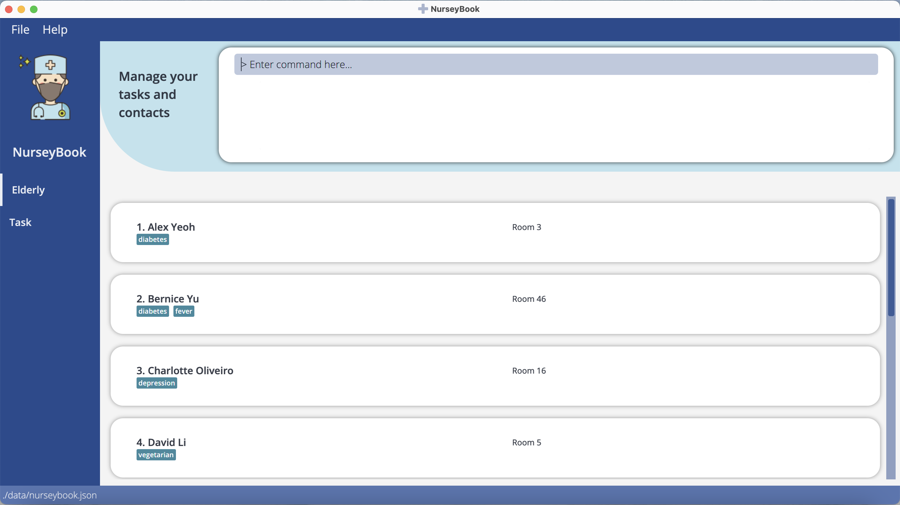

NurseyBook is a **desktop app made for nurses in nursing homes to aid them in managing contacts and tasks in their busy lives. It is optimized for use via a Command Line Interface** (CLI) while still **having the benefits of a Graphical User Interface** (GUI). If you can type fast, NurseyBook can manage your contacts & tasks done faster than traditional GUI apps! :smile:

## Table of Contents
{:toc}

--------------------------------------------------------------------------------------------------------------------

## Quick start

1. Ensure you have Java `11` or above installed in your Computer.

2. Download the latest `nurseybook.jar` from [here](https://github.com/AY2122S1-CS2103T-F13-2/tp/releases).

3. Copy the file to the folder you want to use as the _home folder_ for your NurseyBook.

4. Double-click the file to start the app. The GUI similar to the below should appear in a few seconds. Note how the app contains some sample data. 
   

5. Type the command in the command box and press Enter to execute it. e.g. typing **`help`** and pressing Enter will open the help window. 
   Some example commands you can try:

   * **`viewElderly`** : Lists all elderly contacts.

   * **`viewTasks`** : Lists all tasks.

   * **`addElderly`**`addElderly en/John p/92345678 a/77 r/420 s/M t/diabetes` : Adds a contact named `John` to NurseyBook.

   * **`deleteElderly`**`3` : Deletes the records of the 3rd elderly shown in the current list.

   * **`clear`** : Deletes all contacts.

   * **`exit`** : Exits the app.
   

1. Refer to the [Features](#features) below for details of each command.

--------------------------------------------------------------------------------------------------------------------

## Features

**:information_source: Notes about the command format:** 

* Words in `UPPER_CASE` are the parameters to be supplied by the user. 
  e.g. in `addElderly n/NAME`, `NAME` is a parameter which can be used as `addElderly n/Swee Choon`.

* Items in square brackets are optional. 
  e.g `n/NAME [t/TAG]` can be used as `n/Swee Choon t/vegan` or as `n/Swee Choon`.

* Items with `…`​ after them can be used multiple times including zero times. 
  e.g. `[t/TAG]…​` can be used as ` ` (i.e. 0 times), `t/friend`, `t/friend t/family` etc.

* Parameters can be in any order. 
  e.g. if the command specifies `n/NAME p/PHONE_NUMBER`, `p/PHONE_NUMBER n/NAME` is also acceptable.

* If a parameter is expected only once in the command but you specified it multiple times, only the last occurrence of the parameter will be taken. 
  e.g. if you specify `p/12341234 p/56785678`, only `p/56785678` will be taken.

* Extraneous parameters for commands that do not take in parameters (such as `viewElderly`, `viewTasks`, `exit` and `clear`) will be ignored. 
  e.g. if the command specifies `viewTasks 123`, it will be interpreted as `viewTasks`.

### View all elderly assigned to staff: `viewElderly`

Shows the list of all elderly assigned under a staff (the user).

Format: `viewElderly`

### Adding an elderly: `addElderly`

Adds an elderly to NurseyBook.

Format: `addElderly en/ELDERLY_NAME p/PHONE_NUMBER a/AGE r/ROOMNO s/SEX [t/TAG]…​`

:bulb: **Tip:**
A person can have any number of tags (including 0)

Examples:
* `addElderly en/Khong Guan p/91234567 a/80 r/201 s/M`
* `addElderly en/John p/92345678 a/77 r/420 s/M t/diabetes`

  
### Update an elderly's details: `updateElderly`

Update the details of a specific elderly.

Format: `updateElderly INDEX [en/ELDERLY_NAME] [p/PHONE_NUMBER] [a/AGE][r/ROOMNO] [s/SEX] [t/TAG]…​`

* Any number of tags is acceptable (including 0).

### View details of an elderly: `viewDetails`

View details of a specific elderly
Format: `viewDetails en/ELDERLY_NAME`

### Deleting an elderly : `deleteElderly`

Deletes an elderly from NurseyBook.

Format: `deleteElderly INDEX`

* Deletes the elderly at the specified `INDEX`.
* The index refers to the index number shown in the displayed elderly list.
* The index **must be a positive integer** 1, 2, 3, …​

Examples:
* `viewElderly` followed by `delete 2` deletes the 2nd elderly in NurseyBook.

### Add tags to elderly: `addTag`

Add one or more tags to a specific elderly.

Format: `addTag INDEX t/TAG [t/TAG]…​`

* There should be at least one tag.
* The index refers to the index number shown in the displayed elderly list.
* The index **must be a positive integer** 1, 2, 3, …​

Example:
* `addTag 1 t/covid`

### Delete tags of elderly: `deleteTag`

Delete one or more tags of a specific elderly.

Format: `deleteTag INDEX t/TAG [t/TAG]…​`

* There should be at least one tag.
* The index refers to the index number shown in the displayed elderly list.
* The index **must be a positive integer** 1, 2, 3, …​

Example:
* `deleteTag 1 t/covid`

### Filter elderly: `filter`

Filter elderly based on one or more tags.

Format: `filter t/TAG [t/TAG]…​`

* There should be at least one tag.

Example:
* `filter t/covid t/diabetes`

### View all tasks: `viewTasks`

Shows a list of all tasks for a nurse in the NurseyBook.

Format: `viewTasks`

### Add a task: `addTask`

Adds a task to the task list.

Format: `addTask [en/ELDERLY_NAME]... desc/DESCRIPTION date/DATE time/TIME`  

Example:
`addTask en/John desc/check insulin level date/2021-09-25 time/19:22`

### Delete task: `deleteTask`

Deletes a particular task for a staff user in the task list from NurseyBook

Format: `deleteTask INDEX`

* Deletes the task at the specified `INDEX`.
* The index refers to the index number shown in the displayed task list.
* The index **must be a positive integer** 1, 2, 3, …​

Examples:
* `viewTasks` followed by `delete 2` deletes the 2nd task shown by NurseyBook.

### Mark a task as completed: `doneTask`

Marks a particular task in the task list as completed.

Format: `doneTask INDEX`

* Marks the task at the specified `INDEX` as done.
* The index refers to the index number shown in the displayed task list.
* The index **must be a positive integer** 1, 2, 3, …​

Examples:
* `viewTasks` followed by `done 2` marks the 2nd task shown by NurseyBook as completed.

### View reminders: `remind`

Shows the list of upcoming tasks (that are coming up in the next three days), such as the required 
medical needs for those under the user's care.

Format: `remind`

### Clearing all entries : `clear`

Clears all entries from NurseyBook.

Format: `clear`

### Exiting the program : `exit`

Exits the program.

Format: `exit`

### Saving the data

NurseyBook data are saved in the hard disk automatically after any command that changes the data. There is no need to save manually.

### Editing the data file

NurseyBook data are saved as a JSON file `[JAR file location]/data/nurseybook.json`. Advanced users are welcome to update data directly by editing that data file.

:exclamation: **Caution:**
If your changes to the data file makes its format invalid, NurseyBook will discard all data and start with an empty data file at the next run.

### Archiving data files `[coming in v2.0]`

_Details coming soon ..._

--------------------------------------------------------------------------------------------------------------------

## FAQ

**Q**: How do I transfer my data to another Computer? 
**A**: Install the app in the other computer and overwrite the empty data file it creates with the file that contains the data of your previous NurseyBook home folder.

--------------------------------------------------------------------------------------------------------------------

## Command summary

Action | Format, Examples
--------|------------------
**Add Elderly** | `addElderly en/ELDERLY_NAME p/PHONE_NUMBER a/AGE r/ROOMNO s/SEX [t/TAG]…​`   e.g., `addElderly en/Khong Guan p/92345678 a/77 r/420 s/M t/diabetes`
**Clear** | `clear`
**Delete Elderly** | `deleteElderly INDEX`  e.g., `deleteElderly 3`
**Add Tag** | `addTag INDEX t/TAG [t/TAG]…​` e.g., `addTag 1 t/diabetes`
**Delete Tag** | `deleteTag INDEX t/TAG [t/TAG]…​`
**Filter** | `filter t/TAG [t/TAG]…​`
**Update Elderly** | `updateElderly INDEX [en/ELDERLY_NAME] [p/PHONE_NUMBER] [a/AGE][r/ROOMNO] [s/SEX] [t/TAG]…​`   e.g., `updateElderly en/John p/92345678 a/77 r/420 s/M t/diabetes`
**View Elderly Details** | `viewDetails en/ELDERLY_NAME`  e.g., `viewDetails en/James`
**Remind** | `remind`
**Add task** | `addTask [en/ELDERLY_NAME] desc/DESCRIPTION date/DATE time/TIME`   e.g., `addTask en/John desc/check insulin level date/2021-09-25 time/10.00am`
**Delete task** | `deleteTask INDEX`  e.g., `delete 3`
**Mark task as complete** | `doneTask INDEX`  e.g., `done 3`
**View all tasks** | `viewTasks`
**View all elderly** | `viewElderly`
