* Table of Contents
{:toc}

--------------------------------------------------------------------------------------------------------------------

## 1. Introduction

NurseyBook is a **desktop app made for nurses in nursing homes to aid them in managing contacts and tasks in their busy lives. It is optimized for use via a Command Line Interface** (CLI) while still **having the benefits of a Graphical User Interface** (GUI). If you can type fast, NurseyBook can help you manage your contacts & tasks faster than traditional GUI apps! :smile:

--------------------------------------------------------------------------------------------------------------------

## 2. Quick start

1. Ensure you have Java `11` or above installed in your Computer.

2. Download the latest `nurseybook.jar` from [here](https://github.com/AY2122S1-CS2103T-F13-2/tp/releases).

3. Copy the file to the folder you want to use as the _home folder_ for your NurseyBook.

4. Double-click the file to start the app. The GUI similar to the below should appear in a few seconds. Note how the app contains some sample data. 
   

5. Type the command in the command box and press Enter to execute it. e.g. typing **`help`** and pressing `Enter` will open the help window. 
   Some example commands you can try:

   * **`viewElderly`** : Lists all elderly contacts.

   * **`viewTasks`** : Lists all tasks.

   * **`addElderly`**` en/John a/77 g/M r/420 t/diabetes` : Adds an elderly named `John`.

   * **`deleteElderly`**` 3` : Deletes the records of the 3rd elderly shown in the current list.

   * **`clear`** : Deletes all contacts.

   * **`exit`** : Exits the app.

Refer to the [4. Features](#4-features) below for in-depth details of all available commands.

--------------------------------------------------------------------------------------------------------------------

## 3. About
### 3.1 Structure of this document

This document is structured in a manner that lets you find what you need fast and easily. To jump to various sections, you can refer to the Table of Contents.

In the following subsection, [3.2 Reading this document](#32-reading-this-document), you can find several tips that could be beneficial when reading this guide.
The next section, documents the main features that **NurseyBook** offers and provides you with instructions on how to
use each one of them!
### 3.2 Reading this document

This subsection will introduce to you the symbols, syntax and technical terms that are used throughout this guide.
Being familiar with this subsection will definitely help you out when looking through this guide.

#### 3.2.1 Special symbols

**Additional Information**

Text that appear in an information box indicates additional information that may be useful to know.

:information_source: **Information:**
Example additional information.

**Caution**

Text that appear in a caution box should be followed carefully, else unintended consequences might arise.

:exclamation: **Caution:**
Example warnings.

**Tip**

Text that appear in a tip box are useful for improving your experience with NurseyBook.

:bulb: **Tip:**
Example tip.

#### 3.2.2 Sections of the Application Window

You can refer to the image below for the names of the different sections in NurseyBook's application window.

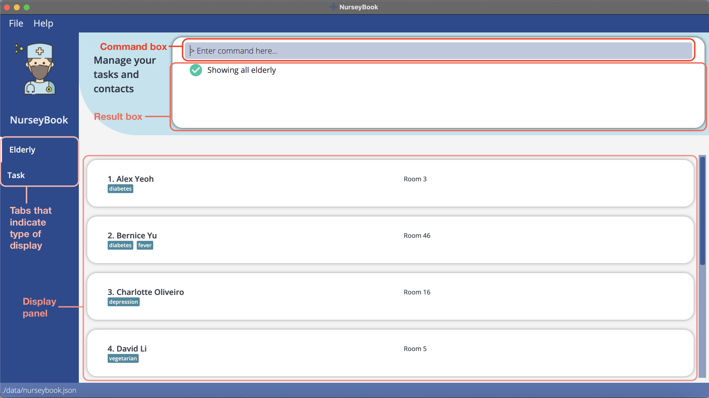

#### 3.2.3 Navigating in NurseyBook

In NurseyBook, some buttons are clickable - such as the File and Help buttons at the top of the application window.
However, the User Interface (UI) is designed primarily to be navigated using the Command Line Interface (CLI).

You can enter commands into the command box and press `Enter` to execute them. The result box will then provide a response on whether the command was successfully executed.
The display panel will similarly update itself, based on the command executed.

#### 3.2.4 Command Format

Words that are highlighted in gray (also known as a mark-up) indicates that they are commands that you can type into the command box, and executed by the application.
e.g. `viewTasks`

Commands in this guide follow such rules:

* Words in `UPPER_CASE` are the parameters to be supplied by you. 
  e.g. in `addElderly en/ELDERLY_NAME`, `ELDERLY_NAME` is a parameter which can be used as `addElderly en/Swee Choon`.

* Items in square brackets are optional. 
  e.g. `en/ELDERLY_NAME [t/TAG]` can be used as `en/Swee Choon t/vegan` or as `en/Swee Choon`.

* Items with `…`​ after them can be used multiple times including zero times. 
  e.g. `[t/TAG]…​` can be used as ` ` (i.e. 0 times), `t/friend`, `t/friend t/family` etc.

* Parameters can be in any order. 
  e.g. if the command specifies `en/ELDERLY_NAME p/NOK_PHONE_NUMBER`, `p/NOK_PHONE_NUMBER en/ELDERLY_NAME` is also acceptable.

:information_source: **Information:**

* If a parameter is expected only once in the command but you specified it multiple times, only the last occurrence of the parameter will be taken. 
  e.g. if you specify `p/12341234 p/56785678`, only `p/56785678` will be taken.

* Commands that do not take in parameters (such as `viewElderly`, `viewTasks`, `clear`, `help`, `exit`) will ignore the additional parameters that are added to the back of it.
  e.g. if the command specifies `viewTasks 123`, it will be interpreted as `viewTasks`.

:bulb: **Tip:**

* The _User Interface_ refers to the NurseyBook application window.
* _Command Line Interface_ refers to where you interact with the system by typing in commands - in this case, the command box.
* _Parameters_ refer to the information to be included as an input to a command.

#### 3.2.5 Command Parameters

The table below provides a summary on the command parameters that are mentioned in this guide.

Parameter | Description
:---------|:-----------
`AGE` | Age of an elderly. A valid age is between 21 to 145.
`DATE` | Date that a task is scheduled to occur on. It should be in the format of yyyy-mm-dd.
`DESCRIPTION` | Description of a task. A description should not be blank.
`ELDERLY_NAME` | Name of an elderly. No two elderly should have the same name.
`GENDER` | Gender of an elderly. Gender is either `M` for males or `F` for females.
`INDEX` | Index is the number shown beside an elderly/task in the **currently displayed** elderly/task list.
`KEYWORD` | Keyword used to search for elderlies (by name) or tasks (by description). `MORE_KEYWORDS` are similarly defined. A keyword should not be blank.
`NOK_ADDRESS` | Address of an elderly's next-of-kin.
`NOK_EMAIL` | Email of an elderly's next-of-kin. An email should be in the format of local-part@domain.
`NOK_NAME` | Name of an elderly's next-of-kin.
`NOK_PHONE_NUMBER` | Phone number of an elderly's next-of-kin. A phone number should either be blank, or at least 8 digits long.
`NOK_RELATIONSHIP` | Relationship between an elderly and his/her next-of-kin.
`RECURRENCE_TYPE` | Indicates the recurrence period of a task. Can be either `NONE`, by `DAY`, `WEEK`, or `MONTH`.
`REMARK` | Additional information that can be supplied to an elderly. It should only be used with elderlies, not tasks.
`ROOMNO` | Room number that an elderly is staying in (the Nursing Home). It should be a non-negative integer.
`TAG` | Tag associated with an elderly. It should only be used with elderlies, not tasks. It should be alphanumeric with no spacing.
`TIME` | Time that a task is scheduled to occur from. It should be in the format of hh:mm in 24 hour clock.

--------------------------------------------------------------------------------------------------------------------

## 4. Features

This section contains the documentation on NurseyBook's features and commands. It is split into the following subsections:

1. [Elderly commands](#41-elderly-commands)
2. [Task commands](#42-task-commands)
3. [Miscellaneous commands](#43-miscellaneous-commands)

### 4.1 Elderly commands

#### 4.1.1 View all elderly: `viewElderly`

This command displays all the elderlies that you have added to NurseyBook.

Format: `viewElderly`

:bulb: **Tip:**
* You can click on an elderly entry to view the full expanded details for that elderly.

    Normal view:
  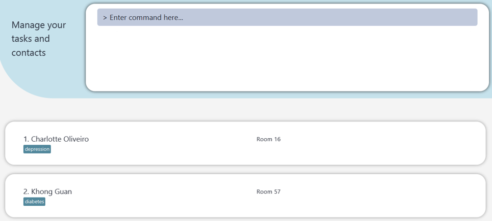
    
     
  
  Expanded view (click on the entry for ‘Charlotte Oliveiro’):
  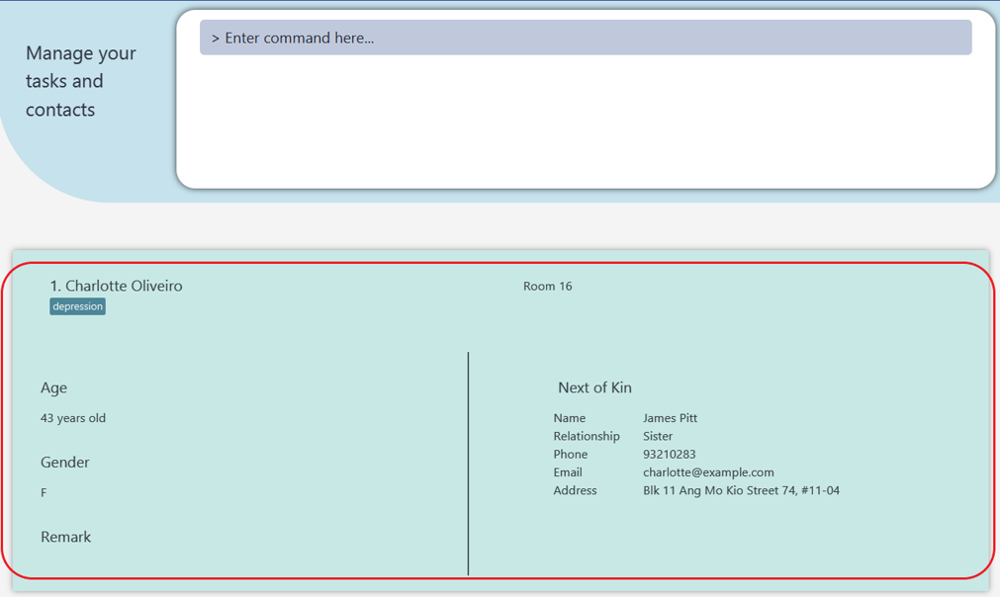

 

#### 4.1.2 Add an elderly: `addElderly`

This command allows you to add an elderly and his/her details to NurseyBook.

Format: `addElderly en/ELDERLY_NAME a/AGE g/GENDER r/ROOMNO [t/TAG]…​ [nn/NOK_NAME] [rs/NOK_RELATIONSHIP] [p/NOK_PHONE_NUMBER] [e/NOK_EMAIL] [addr/NOK_ADDRESS]`

Example:

Let’s say you have a new elderly that has been placed under your charge. You can follow the steps below to add him to NurseyBook using the addElderly command.

To add an elderly: 
1. Type addElderly `en/Khong Guan a/80 g/M r/201` into the command box.
2. Press `Enter` to execute your command. You should see the following.
   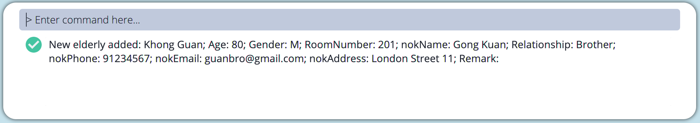

If you would like to include his/her NoK details as well, you can use this longer command instead to add both his/her personal and NoK details at the same time.
* `addElderly en/Khong Guan a/80 g/M r/201 nn/Bing Gan rs/Brother p/91234567 e/guanbro@gmail.com addr/London Street 11`

 
You can also add any custom tags to the elderly as per your needs. Such tags will help you quickly identify key things or notes about each elderly. For instance, you can add a custom tag ‘diabetes’ to make a note that the elderly has diabetes.
* `addElderly en/Khong Guan a/80 g/M r/201 t/diabetes`
    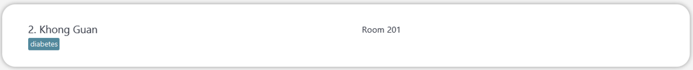

Here is a command that uses tags, and only specifies some NoK fields. It is not compulsory to specify all NoK fields.
* `addElderly en/Khong Guan a/80 g/M r/201 t/diabetes nn/Bing Gan rs/Brother`

:information_source: **Information:**
   
* An elderly can have any number of tags (including 0).
* You can specify a Next-of-Kin's (NoK) details for each elderly, when adding an elderly.
* NurseyBook does not support any two elderly with the same name, even if any other fields are different. The casing of the name does not matter either. A suggestion will be to save the full name of the elderly you are adding into NurseyBook.
  Executing the command will automatically change the display to your full elderly list, so that you can see the elderly you added.

#### 4.1.3 Delete an elderly : `deleteElderly`

This command allows you to delete an elderly that you no longer want to include in NurseyBook.

Format: `deleteElderly INDEX`   

Example:

Let's say Khong Guan is no longer under your charge, or has been discharged from your nursing home. You can follow the steps below to remove his entry from NurseyBook using the deleteElderly command.

To delete an elderly:
1. Enter [`viewElderly`](#411-view-all-elderly-viewelderly) to view the list of elderly and locate the index number of Khong Guan. In the image below, Khong Guan is at index number 2.
    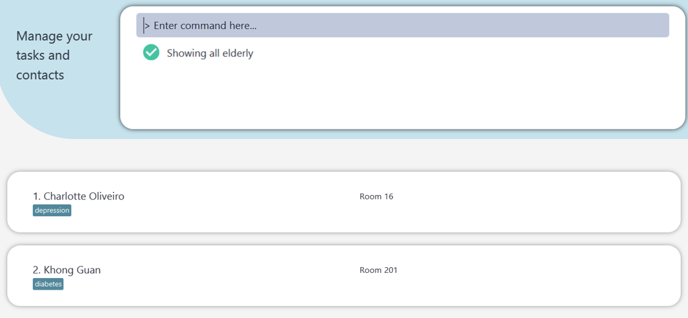

2. Enter `deleteElderly 2` to delete the 2nd elderly in NurseyBook. Khong Guan should no longer be visible.
    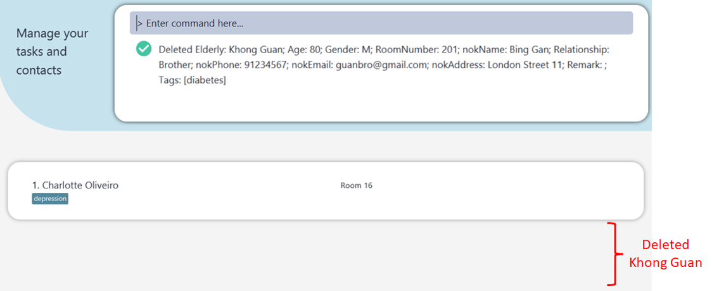

:information_source: **Information:**
* Deletes the elderly at the specified `INDEX`. 
* The index refers to the index number shown in the displayed elderly list.
* The index that you enter **must be a positive integer** 1, 2, 3, …​

:exclamation: **Caution:**
* If you delete an elderly's name, it will cause all occurrences of the elderly's name in tasks to be deleted.

#### 4.1.4 Edit an elderly's details: `editElderly`

This command allows you to fix any mistakes made in the information of elderlies added.

Format: `editElderly INDEX [en/ELDERLY_NAME] [a/AGE] [g/GENDER] [r/ROOMNO] [t/TAG]…​ [nn/NOK_NAME] [rs/NOK_RELATIONSHIP] [p/NOK_PHONE_NUMBER] [e/NOK_EMAIL] [addr/NOK_ADDRESS]`

Example: 

The command is highly similar to [`addElderly`](#412-add-an-elderly-addelderly). Simply enter the index of the elderly, followed by the parameter(s) you would like to change and their corresponding prefixes.

Let's say Khong Guan’s birthday has just passed and he has been reallocated to a different room for a change in environment. You can change both fields at one go by with this command.

To edit an elderly:
1. Enter [`viewElderly`](#411-view-all-elderly-viewelderly) to view the list of elderly and locate the index number of Khong Guan. In the image below, Khong Guan is at index number 2.
      

2. Enter the command `editElderly 2 a/81 r/57`. You can specify any other fields that you would like to change as well.
    
    Before Editting:
    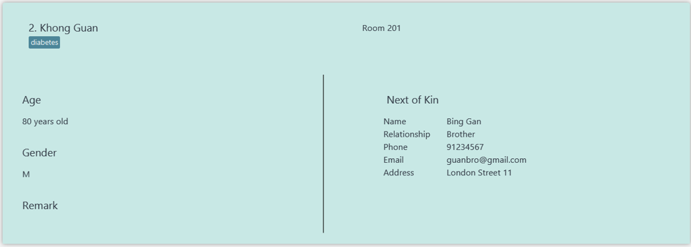

     
  
    After Editting:
    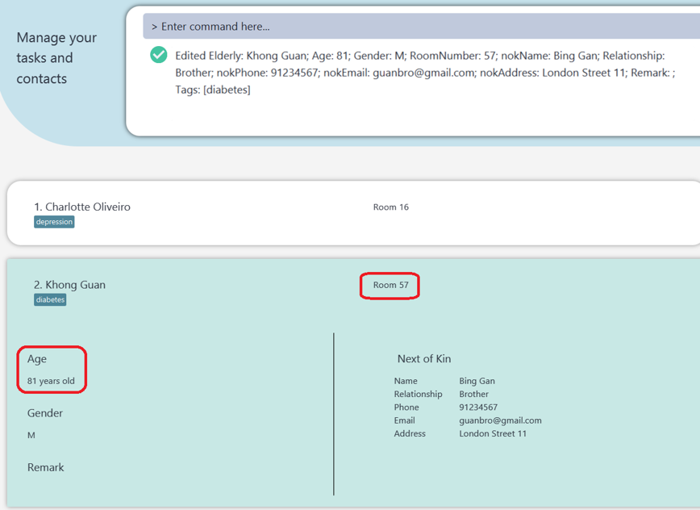

For tags, if Khong Guan has a tag `diabetes`, to add an `overweight` tag to him, your command should be `editElderly 2 t/cancer t/overweight`.

:information_source: **Information:**
* You can enter any number of tags (including 0).
* The index refers to the index number shown in the displayed elderly list.
* The index that you enter must be a positive integer 1, 2, 3, …​

:exclamation: **Caution:**
* By leaving the tag input empty, e.g. `t/`, you will remove all the tags currently assigned to the elderly.
* If you want to add a tag with `editElderly`, you have to include all the existing tags of the elderly in your command.
* If you edit an elderly's name, it will cause all occurrences of the elderly's name in tasks to be edited, but the order they appear in the tasks may be different.

:bulb: **Tip:**
* For more accessible tag related commands, you can refer to the [`addTag`](#418-add-tags-to-elderly-addtag) and [`deleteTag`](#419-delete-tags-of-elderly-deletetag) commands.

#### 4.1.5 Find elderly: `findElderly`

This command allows you to find all the elderlies whose names are related to any of the given keywords. This is especially useful when you have a lot of elderlies stored.

Format: `findElderly KEYWORD [MORE_KEYWORDS]`

Example:

Let’s say you are looking for a certain elderly with the surname ‘Lim’. It is a hassle to go through the full list of elderlies and search for that particular person one by one. To save time, simply use the `findElderly` command.

To find elderly based on keywords:
1. Enter `findElderly lim`
2. This should return all elderlies with the word lim in any part of their name. If only ‘Emily Lim’ and ‘Madoo Lim’ have the word lim  in their name, you should observe the output below.
    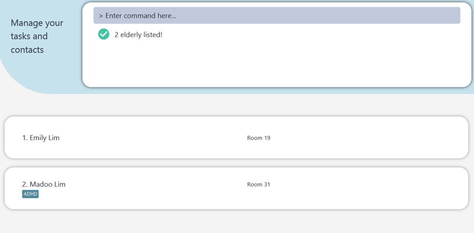
   You can use this filtered list to quickly identify that specific elderly you are searching for.

:information_source: **Information:**
* The search is case-insensitive. e.g. `elena` will match `Elena`
* The order of the keywords does not matter. e.g. `Elena Kro` will match `Kro Elena`
* Your keywords are only compared against the names of elderlies.
* Only full words will be matched. e.g. `Ele` will not match `Elena`
* Elderlies matching at least one keyword will be returned (i.e. `OR` search). e.g. `Elena Kro` will return `Elena Grob`, `Kro Stanly`

#### 4.1.6 View full details of an elderly: `viewDetails`

Displays full details of a specific elderly.

Format: `viewDetails INDEX`

Examples:
* [`viewElderly`](#411-view-all-elderly-viewelderly) followed by `viewDetails 1` displays the details of the 1st elderly in NurseyBook.

:information_source: **Information:**
* Shows the full details of the elderly at the specified `INDEX`.
* The index refers to the index number shown in the displayed elderly list.
* The index **must be a positive integer** 1, 2, 3, …​
* After executing another command that is not a `viewDetails` command, the details panel will close.

`viewDetails 1` used:

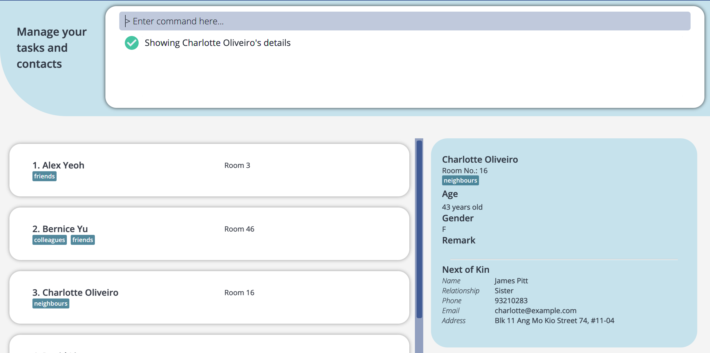

#### 4.1.7 Delete an elderly's NoK details : `deleteNok`

Deletes an elderly's Next-of-Kin details from NurseyBook.

Format: `deleteNok INDEX`

Examples:
* [`viewElderly`](#411-view-all-elderly-viewelderly) followed by `deleteNok 2` deletes the NoK details of the 2nd elderly in NurseyBook.

:information_source: **Information:**
* Deletes the NoK details of the elderly at the specified `INDEX`.
* The index refers to the index number shown in the displayed elderly list.
* The index **must be a positive integer** 1, 2, 3, …​

#### 4.1.8 Add tags to elderly: `addTag`

Adds one or more tags to a specific elderly.

Format: `addTag INDEX t/TAG [t/TAG]…​`

Examples:
* [`viewElderly`](#411-view-all-elderly-viewelderly) followed by `addTag 1 t/covid` adds the tag `covid` to the 1st elderly in NurseyBook.

:information_source: **Information:**
* There should be at least one tag.
* Multiple tags that are the same or have different casing are treated as one tag.
* The index refers to the index number shown in the displayed elderly list.
* The index **must be a positive integer** 1, 2, 3, …​

#### 4.1.9 Delete tags of elderly: `deleteTag`

Deletes one or more tags of a specific elderly.

Format: `deleteTag INDEX t/TAG [t/TAG]…​`

Examples:
* [`viewElderly`](#411-view-all-elderly-viewelderly) followed by `deleteTag 1 t/covid` deletes the tag `covid` from the 1st elderly in NurseyBook.

:information_source: **Information:**
* There should be at least one tag.
* The deletion of tags is case-insensitive.
* Multiple tags that are the same or have different casing are treated as one tag.
* The index refers to the index number shown in the displayed elderly list.
* The index **must be a positive integer** 1, 2, 3, …​

#### 4.1.10 Filter elderly: `filter`

Filters elderly based on one or more tags.

Format: `filter t/TAG [t/TAG]…​`

Examples:
* `filter t/covid t/diabetes`

:information_source: **Information:**
* There should be at least one tag.
* Only complete tags will be matched. e.g. `diab` will not match `diabetes`
* Multiple tags that are the same or have different casing are treated as one tag.
* Elderlies matching all tags will be returned (i.e.`AND` search). e.g. For `filter t/covid t/diabetes`, if the elderly only has the 'diabetes' tag, he will not be returned.
* The matching of tags is case-insensitive. e.g. `t/Diabetic` will match `diabetic`, `DIABETIC`

`filter t/vegetarian` used:

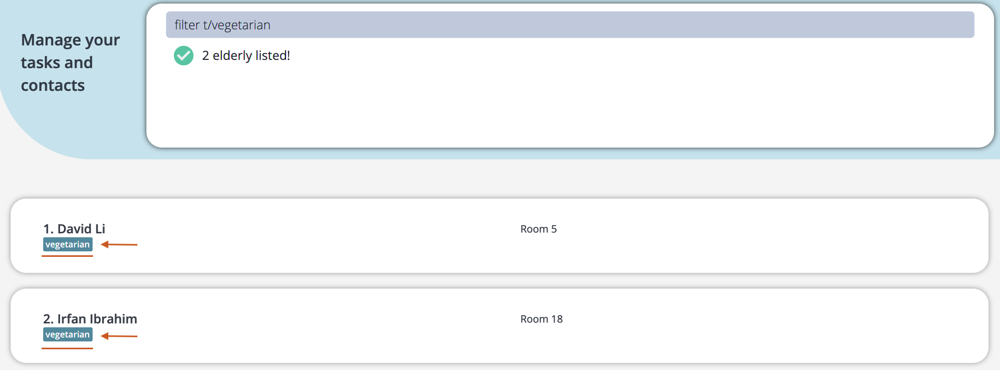

#### 4.1.11 Add remark to elderly: `remark`

Adds a remark to a specific elderly.

Format: `remark INDEX re/REMARK`

Examples:
* [`viewElderly`](#411-view-all-elderly-viewelderly) followed by `remark 1 re/Medicine seems to be ineffective` adds the remark to the 1st elderly in Nurseybook.

:information_source: **Information:**
* The index refers to the index number shown in the displayed elderly list.
* The index **must be a positive integer** 1, 2, 3, …​

:bulb: **Tip:**  

* You can remove a remark by leaving the remark input empty! e.g. [`viewElderly`](#411-view-all-elderly-viewelderly) followed by `remark 1 re/` or `remark 1` removes the remark for the 1st elderly in NurseyBook.

### 4.2 Task commands

#### 4.2.1 View all tasks: `viewTasks`

Shows a list of all your tasks in NurseyBook.

Format: `viewTasks`

:exclamation: **Caution:**
* NurseyBook will not automatically refresh the displayed task list to reflect instantaneous changes, such as overdue tasks and new dates of recurring tasks. *Refer to the tips section [here](#422-add-a-task-addtask) to learn how to create recurring tasks.*
* However, you can manually trigger this refresh, and one way is to enter `viewTasks` in the command box.
* This will update the overdue status of all tasks and new dates of all recurring tasks.
    * e.g. If the time now is 9.01pm and there is an undone task which is due at 9.00pm the same day, you can enter `viewTasks`, otherwise the red overdue tag will not show automatically.
    * e.g. If the time now is 9.01pm and there is a recurring task due at 9.00pm, you can enter `viewTasks`, otherwise the task's date will remain unchanged.

:information_source: **Information:**

* The task list shown is always sorted chronologically with earliest tasks at the top.

#### 4.2.2 Add a task: `addTask`

Adds a task to the task list.

Format: `addTask [en/ELDERLY_NAME]…​ desc/DESCRIPTION date/DATE time/TIME [recur/RECURRENCE_TYPE]`

Examples:
`addTask en/Khong Guan desc/check insulin level date/2022-01-25 time/19:22 recur/week`

:information_source: **Information:**

* Executing the command will automatically change the display view to your full task list, so that you can see the task you added.
* The name entered can be different letter case as the name of the existing elderly. e.g. `en/herman lim` is accepted if `Herman Lim` is a registered elderly
* Multiple of the same elderly name in same/different casing will be treated as one elderly.
* The full name has to be entered so that the identity of the elderly is unambiguous.

:exclamation: **Caution:**
* If you want to add an elderly to the task, you need to first make sure that the elderly is already registered in your elderly database.

:bulb: **Tip:**

* You can add a recurring task to the list!  
  * There are a few recurring options available namely: `NONE`, `DAY`, `WEEK` and `MONTH` (4 weeks later from the previous date). Tasks that have passed their original date will have their date automatically updated to the new date based on the recurrence type of the task.
* If you want to create a non-recurring task, you can exclude the `recur` field. NurseyBook will automatically assume that the task is non-recurring.

`addTask en/Khong Guan desc/check insulin level date/2022-01-25 time/19:22 recur/week` used :

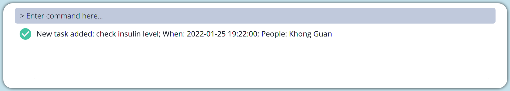
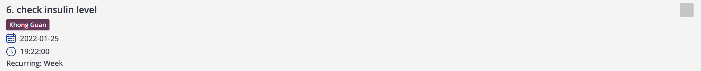

#### 4.2.3 Delete a task: `deleteTask`

Deletes a particular task in the task list from NurseyBook.

Format: `deleteTask INDEX`

Examples:
* [`viewTasks`](#421-view-all-tasks-viewtasks) followed by `deleteTask 2` deletes the 2nd task shown by NurseyBook.

:information_source: **Information:**

* Deletes the task at the specified `INDEX`.
* The index refers to the index number shown in the displayed task list.
* The index **must be a positive integer** 1, 2, 3, …​

#### 4.2.4 Edit a task: `editTask`

Edits the details of a specific task.

Format: `editTask INDEX [en/ELDERLY_NAME]... [desc/DESCRIPTION] [date/DATE] [time/TIME] [recur/RECURRENCE_TYPE]`

Examples:
* [`viewTasks`](#421-view-all-tasks-viewtasks) followed by `editTask 1 date/2022-01-30` changes the date of the 1st task shown by NurseyBook to 30 January 2022.

:information_source: **Information:**

* If the date/recurrence type of a recurring task is edited, the updated date generated will be based on the most recently edited date.
* Multiple of the same elderly name in same/different casing will be treated as one elderly.
* The full name has to be entered so that the identity of the elderly is unambiguous.

e.g. Date of task is `2022-01-01` with `daily` recurrence. On `2022-01-03`, the task is edited to be `weekly` recurring. When the next occurrence of the task is generated by NurseyBook, the date of the task will be `2022-01-10`.

:exclamation: **Caution:**
* If you want to edit the names of any elderlies linked to a task, you need to first make sure all the elderlies' names are already registered in your elderly database.

#### 4.2.5 Find a task: `findTask`

Finds tasks whose description contain any of the given keywords.

Format: `findTask KEYWORD [MORE_KEYWORDS]`

Examples:
* `findTask Day` returns `day` and `Day routine`
* `findTask Day shift` returns `Day routine`, `Shift items`

:information_source: **Information:**

* The search is case-insensitive. e.g. `shift` will match `Shift`
* The order of the keywords does not matter. e.g. `Day shift` will match `shift Day`
* Only the description is searched.
* Only full words will be matched. e.g. `Sh` will not match `Shift`
* Task matching at least one keyword will be returned (i.e. `OR` search). e.g. `Day shift` will return `Day routine`, `Shift items`

`findTask report` used:

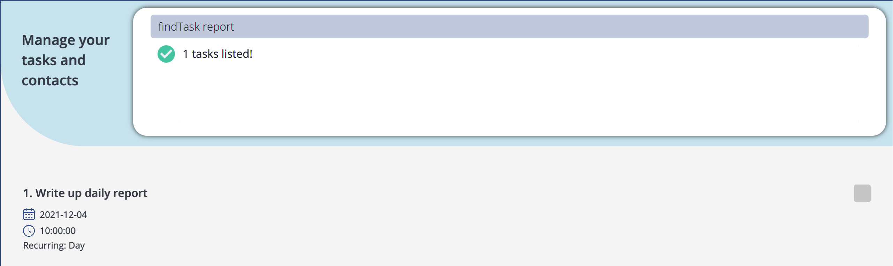

#### 4.2.6 Mark a task as completed: `doneTask`

Marks a particular task in the task list as completed.

Format: `doneTask INDEX`

Examples:
* [`viewTasks`](#421-view-all-tasks-viewtasks) followed by `doneTask 2` marks the 2nd task shown by NurseyBook as completed.

:information_source: **Information:**

* Marks the task at the specified `INDEX` as done.
* The index refers to the index number shown in the displayed task list.
* The index **must be a positive integer** 1, 2, 3, …​
* After marking an overdue task as completed, the overdue tag will no longer be displayed.

#### 4.2.7 View reminders: `remind`

Shows the list of upcoming tasks (that are coming up in the next three days), such as the required medical needs for
those under your care. e.g. If the current date is 2021-11-12, the tasks that are scheduled to happen up to and including 2021-11-15 will be shown. Tasks schduled for 2021-11-16 and onwards will not be shown.

Format: `remind`

Screenshot taken on 2021-11-04.

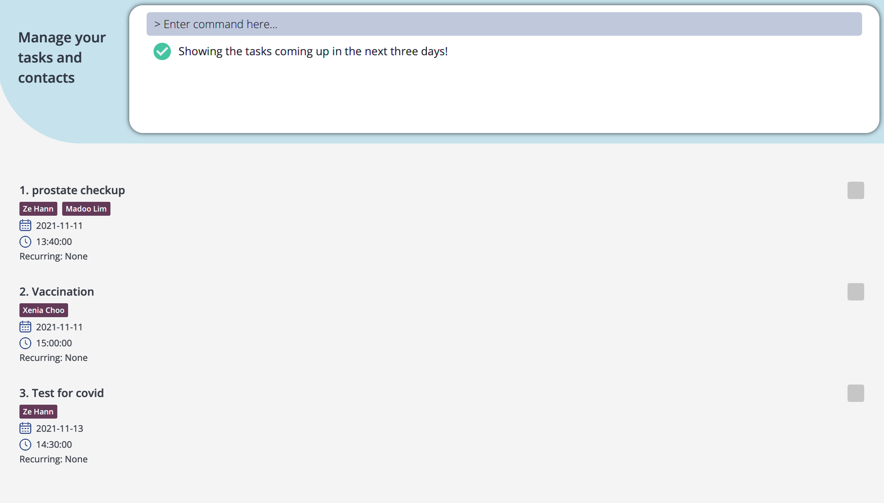

#### 4.2.8 View task schedule: `viewSchedule`

Displays a preview of the list of tasks set to occur on the specified current or future date.
Future occurrences of recurring tasks that will take place on that date are also included.

Format: `viewSchedule DATE`

Example:
`viewSchedule 2022-02-14`

:information_source: **Information:**
* Date must be in yyyy-mm-dd form.
* You can view your schedule for up to 12 weeks, or 84 days, in advance from the current date. Viewing schedule beyond that is not supported.
* You cannot view the schedule on a day that has already passed.
* For recurring tasks, this is simply a tool to preview its future occurrences. You cannot modify (e.g. delete/edit/mark as done/etc.) any such future occurrences of recurring tasks shown in the task list. These future occurrences will be deleted from your task view upon entering any next valid or invalid input.

`viewSchedule 2021-12-20` used:

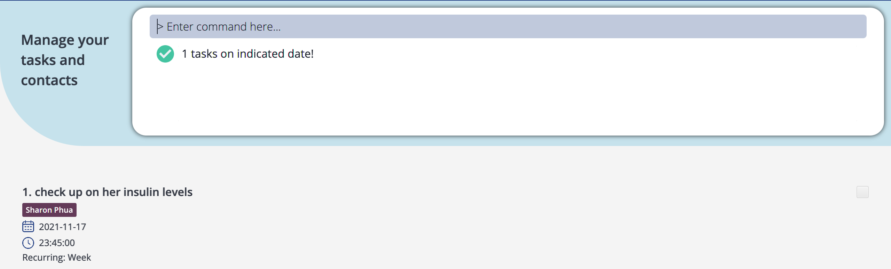

### 4.3 Miscellaneous commands

#### 4.3.1 Clearing all entries : `clear`

Clears all entries from NurseyBook.

Format: `clear`

#### 4.3.2 Viewing help : `help`

A new window that contains a summary of the commands (with the necessary command parameters) as well as a link to this user guide will appear. The link can be copied to the system's clipboard by clicking on the `Copy` button.

Format: `help`

:bulb: **Tip:**
* The help window is more optimized for viewing if the command is entered when NurseyBook is not in full screen mode.

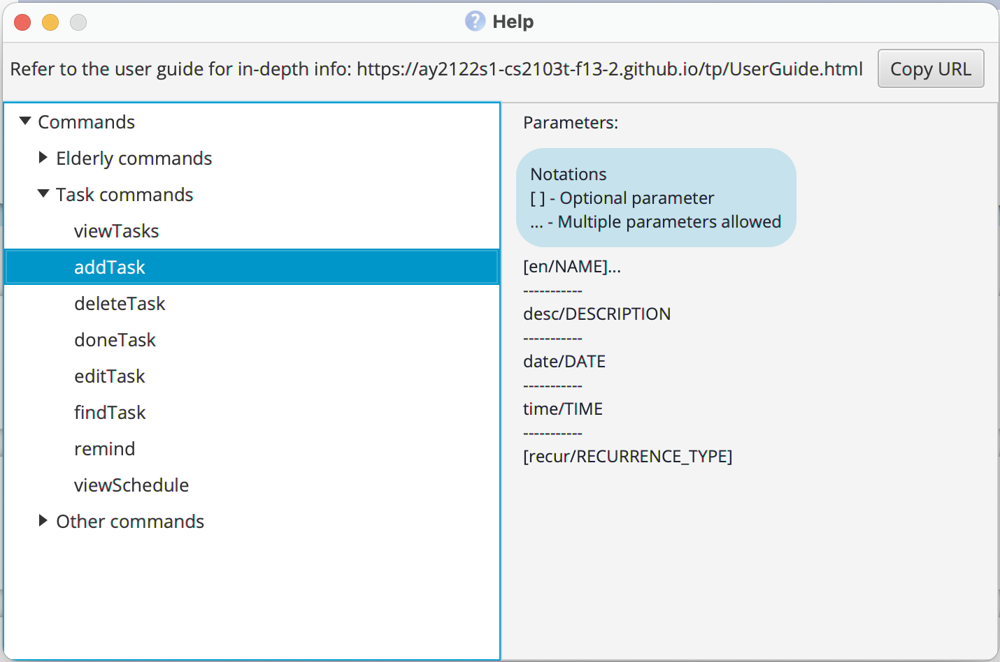

#### 4.3.3 Undo previous command : `undo`

Undoes the previous undoable command executed on the NurseyBook.

Format: `undo`

Example:
* `deleteElderly 1` followed by `undo` causes the `deleteElderly 1` command to be undone and no elderly is deleted from the NurseyBook.

:information_source: **Information:**

* Undoable commands (i.e. any command that modifies NurseyBook's data): `addElderly`, `editElderly`, `deleteElderly`, `deleteNok`, `addTag`, `deleteTag`, `remark`, `addTask`, `editTask`, `deleteTask`, `doneTask`, `clear`
* Non-undoable commands: `findElderly`, `filter`, `viewDetails`, `viewElderly`, `findTask`, `remind`, `viewTasks`, `viewSchedule`, `help`
* If there are no undoable commands executed previously, the undo command will fail and an error message will be shown.
* Undo-ing a `deleteElderly` or an `editElderly` command would restore the elderly's name in relevant tasks but the order of names may be different.

#### 4.3.4 Redo previously undone command : `redo`

Reverses the previous `undo` command executed on the NurseyBook.

Format: `redo`

Example:
* `deleteElderly 1` followed by `undo` causes the `deleteElderly 1` command to be undone and no elderly is deleted from the NurseyBook.
  Entering `redo` will reverse the previous undo command, causing the elderly to be deleted again.

:information_source: **Information:**

* If there are no undo commands executed previously, the redo command will fail and an error message will be shown.
* Redo-ing an `editElderly` command would restore the elderly's name in relevant tasks but the order of names may be different.

#### 4.3.5 Exiting the program : `exit`

Exits the program.

Format: `exit`

--------------------------------------------------------------------------------------------------------------------

## 5. Storage

### 5.1 Saving the data

NurseyBook's data are saved in the hard disk automatically after any command that changes the data. There is no need to save manually.

### 5.2 Editing the data file

NurseyBook data are saved as a JSON file `[JAR file location]/data/nurseybook.json`. If you are technologically savvy, you
are also welcome to update data directly by editing that data file.

:exclamation: **Caution:**
* If your changes to the data file makes its format invalid, NurseyBook will discard all data and start with an empty data file at the next run.
* This includes:
  * adding non-existent elderly names to tasks,
  * adding elderly names in a different case to tasks (e.g. Elderly `Khong Guan` within elderlies but a task's elderly names contain `khong guan`),
  * failing to remove/edit all instances of an elderly name you have deleted/edited within the tasks.

--------------------------------------------------------------------------------------------------------------------

## 6. FAQ

**Q**: How do I transfer my data to another Computer? 
**A**: Install the app in the other computer and overwrite the empty data file NurseyBook creates, with the file
that contains the data of your previous NurseyBook home folder.

**Q**: How do I save my data? 
**A**: NurseyBook's data is saved in the hard disk automatically after any command that changes the data.
There is no need to save manually.

--------------------------------------------------------------------------------------------------------------------

## 7. Command summary

### 7.1 Elderly

Action | Format, Examples
--------|------------------
**Add an elderly** | `addElderly en/ELDERLY_NAME a/AGE r/ROOMNO g/GENDER [t/TAG]…​ [nn/NOK_NAME] [rs/NOK_RELATIONSHIP] [p/NOK_PHONE_NUMBER] [e/NOK_EMAIL] [addr/NOK_ADDRESS]`     e.g., `addElderly en/Khong Guan a/80 g/M r/201 nn/Gong Kuan rs/Brother p/91234567 e/guanbro@gmail.com addr/London Street 11`
**Delete an elderly** | `deleteElderly INDEX`     e.g., `deleteElderly 3`
**Edit an elderly** | `editElderly INDEX [en/ELDERLY_NAME] [a/AGE] [g/GENDER] [r/ROOMNO] [t/TAG]…​ [nn/NOK_NAME] [rs/NOK_RELATIONSHIP] [p/NOK_PHONE_NUMBER] [e/NOK_EMAIL] [addr/NOK_ADDRESS] [re/REMARK]`
**Find an elderly** | `findElderly KEYWORD [MORE_KEYWORDS]`
**Delete next-of-kin of elderly** | `deleteNok INDEX`    e.g., `deleteNok 3`
**Add tag(s)** | `addTag INDEX t/TAG [t/TAG]…​`     e.g., `addTag 1 t/diabetes`
**Delete tag(s)** | `deleteTag INDEX t/TAG [t/TAG]…​`
**Filter** | `filter t/TAG [t/TAG]…​`
**Remark** | `remark INDEX re/REMARK`
**View elderly details** | `viewDetails INDEX`    e.g., `viewDetails 2`
**View all elderly** | `viewElderly`

### 7.2 Task

Action | Format, Examples
--------|------------------
**Add a task** | `addTask [en/ELDERLY_NAME] desc/DESCRIPTION date/DATE time/TIME [recur/RECURRENCE_TYPE]`     e.g., `addTask en/Alex Yeoh desc/check insulin level date/2022-01-25 time/10:00 recur/week`
**Delete a task** | `deleteTask INDEX`  e.g., `deleteTask 3`
**Edit a task** | `editTask INDEX [en/ELDERLY_NAME] [desc/DESCRIPTION] [date/DATE] [time/TIME] [recur/RECURRENCE_TYPE]`     e.g., `editTask 2 desc/Meeting with head nurse`
**Find a task** | `findTask KEYWORD [MORE_KEYWORDS]`
**Mark a task as complete** | `doneTask INDEX`  e.g., `doneTask 3`
**Remind** | `remind`
**View Schedule** | `viewSchedule DATE`   e.g., `viewSchedule 2022-02-14`
**View all tasks** | `viewTasks`

### 7.3 Miscellaneous

Action | Format, Examples
--------|------------------
**Clear** | `clear`
**Help** | `help`
**Undo** | `undo`
**Redo** | `redo`
**Exit** | `exit`

--------------------------------------------------------------------------------------------------------------------

## 8. Glossary

Term | Definition
--------|------------------
**Command Line Interface (CLI)** | Command line interface where users interact with the system by typing in commands.     e.g., Terminal
**Graphical User Interface (GUI)** | Graphical user interface where users interact with the system through visual representations.     e.g., Microsoft Windows Desktop
**JAR** | A file format that contains all bundled Java files (relevant to NurseyBook).
**Java 11** | The Java Platform, Standard Edition 11 Development Kit (JDK 11) is a feature release of the Java SE platform.
**Javascript Object Notation (JSON)** | JSON is a lightweight text format for storing and transporting data.            
