* Table of Contents
{:toc}

--------------------------------------------------------------------------------------------------------------------

## 1. Introduction

NurseyBook is a **desktop app** made for nurses in nursing homes to aid them in **managing contacts and tasks** in their busy lives. NurseyBook helps you categorise your elderlies, efficiently record down important details about them as well as better prioritize your tasks and much more!

This application uses a command line interface. This means that you operate the application by typing commands into a Command Box.
Though this may seem daunting, this user guide will bring you through each feature step-by-step to make sure that you have an easy time using NurseyBook.

--------------------------------------------------------------------------------------------------------------------

## 2. Quick start

1. Ensure you have Java `11` or above installed in your Computer.
   * Windows users: You can open Windows Powershell and enter the command `java -version`.
   * Mac users: You can open Terminal and enter the command `java -version`.
   * If you see `java version “11.0.x”` on your screen, you have Java `11` installed.
   * If you do not, you can install it from [here](https://www.oracle.com/java/technologies/downloads/)
   
2. Download the latest `nurseybook.jar` from [here](https://github.com/AY2122S1-CS2103T-F13-2/tp/releases).

3. Copy the file to the folder you want to use as the _home folder_ for your NurseyBook.

4. Double-click the file to start the app. You should see an application window similar to the image below appear in a few seconds. The app should contain some sample data. 
   

5. Type the command in the command box and press Enter to execute it. e.g. typing **`help`** and pressing `Enter` will open the help window. 
   Some example commands you can try:

   * **`viewElderly`** : Lists all elderly contacts.

   * **`viewTasks`** : Lists all tasks.

   * **`addElderly`**` en/John a/77 g/M r/420 t/diabetes` : Adds an elderly named `John`.

   * **`deleteElderly`**` 3` : Deletes the records of the 3rd elderly shown in the current list.

   * **`clear`** : Deletes all contacts.

   * **`exit`** : Exits the app.

Refer to the [4. Features](#4-features) below for in-depth details of all available commands.

--------------------------------------------------------------------------------------------------------------------

## 3. About
### 3.1 Structure of this document

This document is structured in a manner that lets you find what you need fast and easily. To jump to various sections, you can refer to the Table of Contents.

In the following subsection, [3.2 Reading this document](#32-reading-this-document), you can find several tips that could be beneficial when reading this guide.
The next section, [4. Features section](#4-features), documents the main features that **NurseyBook** offers and provides you with instructions on how to
use each one of them!
### 3.2 Reading this document

This subsection will introduce to you the symbols, syntax and technical terms that are used throughout this guide.
Being familiar with this subsection will definitely help you out when looking through this guide.

#### 3.2.1 Special symbols

**Additional Information**

Texts that appear in an information box indicate additional information that may be useful to know.

:information_source: **Information:**
Example additional information.

**Caution**

Texts that appear in a caution box should be followed carefully, else unintended consequences might arise.

:exclamation: **Caution:**
Example warnings.

**Tip**

Texts that appear in a tip box are useful for improving your experience with NurseyBook.

:bulb: **Tip:**
Example tip.

#### 3.2.2 Sections of the Application Window

You can refer to the image below for the functions of the different sections in NurseyBook's application window.

#### 3.2.3 Navigating in NurseyBook

In NurseyBook, there are some buttons that you can click on- such as the File and Help buttons at the top of the application window. However, most of your interactions with NurseyBook are done through the command box!

You can enter commands into the command box and press `Enter` to execute them. The result box will then provide a response on whether the command was successfully executed.
The display panel will similarly update itself, based on the command executed.

#### 3.2.4 Command Format

Words that are highlighted in gray (also known as a mark-up) indicates that they are commands that you can type into the command box, and executed by the application.
e.g. `viewTasks`

Commands in this guide follow such rules:

* Words in _UPPER_CASE_ are the parameters to be supplied by you. 
  e.g. in `addElderly en/ELDERLY_NAME`, `ELDERLY_NAME` is a parameter which can be used as `addElderly en/John`.

* Items in square brackets are optional. You can choose to leave them out. 
  e.g. `en/ELDERLY_NAME [t/TAG]` can be used as `en/John t/vegan` or as `en/John`.

* Items with `…`​ after them can be used multiple times including zero times. 
  e.g. `[t/TAG]…​` can be used as ` ` (i.e. 0 times), `t/friend`, `t/friend t/family` etc.

* You can enter parameters in any order. 
  e.g. if the command specifies `en/ELDERLY_NAME p/NOK_PHONE_NUMBER`, `p/NOK_PHONE_NUMBER en/ELDERLY_NAME` is also acceptable.

:information_source: **Information:**

* If a parameter is expected only once in the command but you specified it multiple times, only the last occurrence of the parameter will be taken. 
  e.g. if you specify `p/12341234 p/56785678`, only `p/56785678` will be taken.

* Commands that do not take in parameters (such as `viewElderly`, `viewTasks`, `clear`, `help`, `exit`) will ignore the additional parameters that are added to the back of it.
  e.g. if the command specifies `viewTasks 123`, it will be interpreted as `viewTasks`.

:bulb: **Tip:**

* _Parameters_ refer to the information you include as an input to a command.

#### 3.2.5 Command Parameters

The table below provides a summary on the command parameters that are mentioned in this guide.

Parameter | Description
:---------|:-----------
`AGE` | Age of an elderly. You can only enter ages between 21 to 145.
`DATE` | Date that a task is scheduled to occur on. You should enter dates in the yyyy-mm-dd format.
`DESCRIPTION` | Description of a task. Your description should not be blank.
`ELDERLY_NAME` | Name of an elderly. You cannot enter two elderly with the same name.
`GENDER` | Gender of an elderly. You can only set gender to be either `M` for males or `F` for females.
`INDEX` | Index is the number you see beside an elderly/task in the **currently displayed** elderly/task list.
`KEYWORD` | Keyword used to search for elderlies (by name) or tasks (by description). `MORE_KEYWORDS` are similarly defined. Your keyword(s) should not be blank.
`NOK_ADDRESS` | Address of an elderly's next-of-kin.
`NOK_EMAIL` | Email of an elderly's next-of-kin. You should enter an email in the format of local-part@domain.
`NOK_NAME` | Name of an elderly's next-of-kin.
`NOK_PHONE_NUMBER` | Phone number of an elderly's next-of-kin. You can only set the phone number to be blank or an 8 digit number.
`NOK_RELATIONSHIP` | Relationship between an elderly and his/her next-of-kin.
`RECURRENCE_TYPE` | Indicates the recurrence period of a task. You can enter either `NONE`, by `DAY`, `WEEK`, or `MONTH`.
`REMARK` | Additional information that can be supplied to an elderly. You can only add a remark for elderlies, not tasks.
`ROOMNO` | Room number that an elderly is staying in (the Nursing Home). You can only set non-negative numbers as the room number.
`TAG` | Tag associated with an elderly. It should only be used with elderlies, not tasks. You can only enter numbers or letters. Spaces are not allowed.
`TIME` | Time that a task is scheduled to occur from. You should enter time in the format of hh:mm in 24-hour clock.

--------------------------------------------------------------------------------------------------------------------

## 4. Features

This section contains the documentation on NurseyBook's features and commands. It is split into the following subsections:

1. [Elderly commands](#41-elderly-commands)
2. [Task commands](#42-task-commands)
3. [Miscellaneous commands](#43-miscellaneous-commands)

### 4.1 Elderly commands

#### 4.1.1 View all elderly: `viewElderly`

This command displays all the elderlies that you have added to NurseyBook.

Format: `viewElderly`

:bulb: **Tip:**
* You can click on an elderly entry to view the full expanded details for that elderly.

    Normal view:
  
    
    

  
  Expanded view (click on the entry for ‘Charlotte Oliveiro’):
  

 

#### 4.1.2 Add an elderly: `addElderly`

This command allows you to add an elderly and his/her details to NurseyBook.

Format: `addElderly en/ELDERLY_NAME a/AGE g/GENDER r/ROOMNO [t/TAG]…​ [nn/NOK_NAME] [rs/NOK_RELATIONSHIP] [p/NOK_PHONE_NUMBER] [e/NOK_EMAIL] [addr/NOK_ADDRESS]`

Example:

Let’s say you have a new elderly, Khong Guan, that has been placed under your charge. You can follow the steps below to add him to NurseyBook using the addElderly command.

To add an elderly: 
1. Type `addElderly en/Khong Guan a/80 g/M r/201` into the command box.
2. Press `Enter` to execute your command. You should see the following.
   

If you would like to include the elderly's NoK details as well, you can use this longer command instead to add both his/her personal and NoK details at the same time.
* `addElderly en/Khong Guan a/80 g/M r/201 nn/Bing Gan rs/Brother p/91234567 e/guanbro@gmail.com addr/London Street 11`

 
You can also add any custom tags to the elderly as per your needs. Such tags will help you quickly identify key things or notes about each elderly. For instance, you can add a custom tag ‘diabetes’ to make a note that the elderly has diabetes.
* `addElderly en/Khong Guan a/80 g/M r/201 t/diabetes`
    

Here is a command that uses tags, and only specifies some NoK fields. It is not compulsory to specify all NoK fields.
* `addElderly en/Khong Guan a/80 g/M r/201 t/diabetes nn/Bing Gan rs/Brother`

:information_source: **Information:**
   
* An elderly can have any number of tags (including 0).
* You can specify a Next-of-Kin's (NoK) details for each elderly, when adding an elderly.
* NurseyBook does not support any two elderly with the same name, even if any other fields are different. The casing of the name does not matter either. A suggestion will be to save the full name of the elderly you are adding into NurseyBook.
  Executing the command will automatically change the display to your full elderly list, so that you can see the elderly you added.

#### 4.1.3 Delete an elderly : `deleteElderly`

This command allows you to delete an elderly that you no longer want to include in NurseyBook.

Format: `deleteElderly INDEX`   

Example:

Let's say Khong Guan is no longer under your charge, or has been discharged from your nursing home. You can follow the steps below to remove his entry from NurseyBook using the deleteElderly command.

To delete an elderly:
1. Enter [`viewElderly`](#411-view-all-elderly-viewelderly) to view the list of elderly and locate the index number of Khong Guan. In the image below, Khong Guan is at index number 2.
    

2. Enter `deleteElderly 2` to delete the second elderly in NurseyBook. Khong Guan should no longer be visible.
    

:information_source: **Information:**
* Deletes the elderly at the specified `INDEX`. 
* The index refers to the index number shown in the displayed elderly list.
* The index that you enter **must be a positive integer** 1, 2, 3, …​

:exclamation: **Caution:**
* If you delete an elderly's name, it will cause all occurrences of the elderly's name in tasks to be deleted.

#### 4.1.4 Edit an elderly's details: `editElderly`

This command allows you to fix any mistakes made in the information of elderlies added.

Format: `editElderly INDEX [en/ELDERLY_NAME] [a/AGE] [g/GENDER] [r/ROOMNO] [t/TAG]…​ [nn/NOK_NAME] [rs/NOK_RELATIONSHIP] [p/NOK_PHONE_NUMBER] [e/NOK_EMAIL] [addr/NOK_ADDRESS]`

Example: 

The command is highly similar to [`addElderly`](#412-add-an-elderly-addelderly). Simply enter the index of the elderly, followed by the parameter(s) you would like to change and their corresponding prefixes.

Let's say Khong Guan’s birthday has just passed and he has been reallocated to a different room for a change in environment. You can change both fields at one go by with this command.

To edit an elderly:
1. Enter [`viewElderly`](#411-view-all-elderly-viewelderly) to view the list of elderly and locate the index number of Khong Guan. In the image below, Khong Guan is at index number 2.
    

2. Enter the command `editElderly 2 a/81 r/57`. You can specify any other fields that you would like to change as well.
   
    Before Editing:
    

    

    After Editing:
    

For tags, if Khong Guan has a tag `diabetes`, to add an `overweight` tag to him, your command should be `editElderly 2 t/cancer t/overweight`.

:information_source: **Information:**
* You can enter any number of tags (including 0).
* The index refers to the index number shown in the displayed elderly list.
* The index that you enter must be a positive integer 1, 2, 3, …​

:exclamation: **Caution:**
* By leaving the tag input empty, e.g. `t/`, you will remove all the tags currently assigned to the elderly.
* If you want to add a tag with `editElderly`, you have to include all the existing tags of the elderly in your command.
* If you edit an elderly's name, it will cause all occurrences of the elderly's name in tasks to be edited, but the order they appear in the tasks may be different.

:bulb: **Tip:**
* For more accessible tag related commands, you can refer to the [`addTag`](#418-add-tags-to-elderly-addtag) and [`deleteTag`](#419-delete-tags-of-elderly-deletetag) commands.

#### 4.1.5 Find elderly: `findElderly`

This command allows you to find all the elderlies whose names contain any of the given keywords. This is especially useful when you have a lot of elderlies stored.

Format: `findElderly KEYWORD [MORE_KEYWORDS]`

Example:

Let’s say you are looking for a certain elderly with the surname ‘Lim’. It is a hassle to go through the full list of elderlies and search for that particular person one by one. To save time, simply use the `findElderly` command.

To find elderly based on keywords:
1. Enter `findElderly lim`.
2. This should return all elderlies with the word "lim" in any part of their name. If only ‘Emily Lim’ and ‘Madoo Lim’ have the word lim  in their name, you should observe the output below.
    
   You can use this filtered list to quickly identify that specific elderly you are searching for.

:information_source: **Information:**
* The search is case-insensitive. e.g. `elena` will match `Elena`
* The order of the keywords does not matter. e.g. `Elena Kro` will match `Kro Elena`
* Your keywords are only compared against the names of elderlies.
* Only full words will be matched. e.g. `Ele` will not match `Elena`
* Elderlies matching at least one keyword will be returned (i.e. _OR_ search). e.g. `Elena Kro` will return `Elena Grob`, `Kro Stanly`

#### 4.1.6 View full details of an elderly: `viewDetails`

This command displays the full details of a specific elderly.

Format: `viewDetails INDEX`

Example:

Let’s say that you would like to view the remark or Next-of-Kin (NoK) details of Khong Guan. However, these details are not shown in the elderly list. To view the full details of an elderly, you can use the `viewDetails` command.

To view the full details of an elderly:
1. Enter [`viewElderly`](#411-view-all-elderly-viewelderly) to view the list of elderly. 
2. As Khong Guan is the second elderly in the list, enter `viewDetails 2` and you will be able to see the full details of Khong Guan in the details panel on the right side of the application screen.

    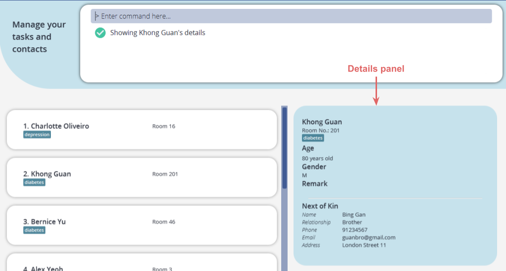

:information_source: **Information:**
* Shows the full details of the elderly at the specified `INDEX`.
* The index refers to the index number shown in the displayed elderly list.
* The index that you enter **must be a positive integer** 1, 2, 3, …​
* If you execute another type of command after a `viewDetails` command, the details panel will close.

#### 4.1.7 Delete an elderly's NoK details : `deleteNok`

This command allows you to delete an elderly's Next-of-Kin details from NurseyBook.

Format: `deleteNok INDEX`

Example:

Let’s say Khong Guan’s NoK information is no longer relevant and you want to delete the NoK details from Khong Guan. The `deleteNok` command can help you do so.

To delete NoK details of an elderly:
1. Enter [`viewElderly`](#411-view-all-elderly-viewelderly) to view the list of elderly.
2. Enter `deleteNok 2` to delete the NoK details of the second elderly in NurseyBook, which is Khong Guan.
3. From the result message, you can see that the description of Khong Guan has empty NoK fields. Alternatively, you can also click on the elderly to see the full details. The NoK name is now `NIL`.

    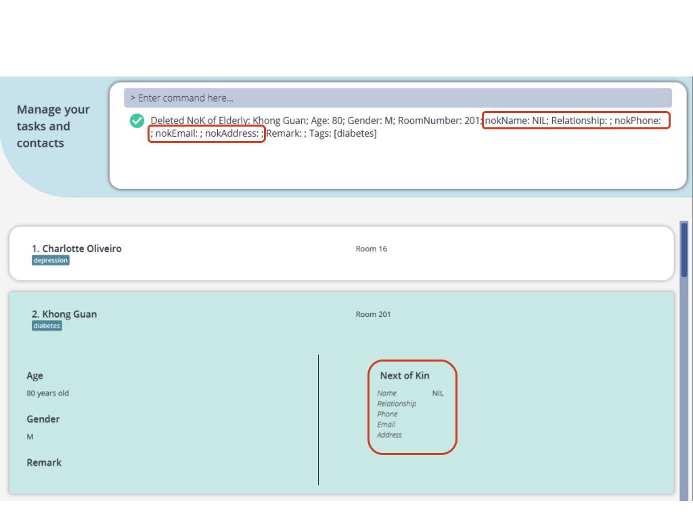

:information_source: **Information:**
* Deletes the NoK details of the elderly at the specified `INDEX`.
* The index refers to the index number shown in the displayed elderly list.
* The index that you enter **must be a positive integer** 1, 2, 3, …​

#### 4.1.8 Add tags to elderly: `addTag`

This command allows you to add one or more tags to a specific elderly on top of the existing tags the elderly has.

Format: `addTag INDEX t/TAG [t/TAG]…​`

Example:

Let’s say Khong Guan is down with a flu, and you would like to add a tag to him to note it down. While `editElderly` allows you to edit the tags of an elderly, it clears all existing tags that the elderly has, which is not the desired behaviour as you want to keep the existing tags. To add one or more tags on top of existing tags, you can use the `addTag` command!

To add one or more tags:
1. Enter [`viewElderly`](#411-view-all-elderly-viewelderly) to view the list of elderly.
2. Enter `addTag 2 t/flu` to add the tag `flu` to Khong Guan. The index is 2 as Khong Guan is the second elderly in this list.

    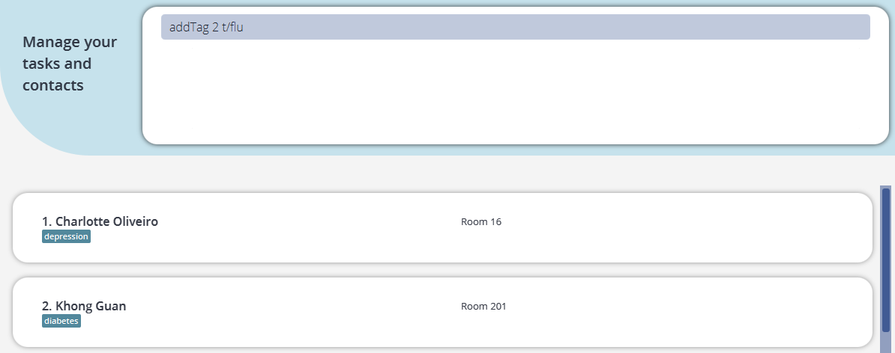
3. You can check that the `flu` tag is added to the elderly.

    

:information_source: **Information:**
* You must enter at least one tag.
* Multiple tags that are the same or have different casing are treated as one tag. e.g. If you enter `t/Diabetic t/diabetic`, they will be taken as one tag which is the first one entered: `t/Diabetic`
* The index refers to the index number shown in the displayed elderly list.
* The index that you enter **must be a positive integer** 1, 2, 3, …​

#### 4.1.9 Delete tags of elderly: `deleteTag`

This command allows you to delete one or more tags of a specific elderly.

Format: `deleteTag INDEX t/TAG [t/TAG]…​`

Example:

Let’s say Khong Guan has recovered from his flu, and you want to remove the `flu` tag from his details. Instead of using the `editElderly` command that clears all the elderly’s tags, you can use the `deleteTag` command to specify which tag to delete.

To delete one or more tags from an elderly:
1. Enter [`viewElderly`](#411-view-all-elderly-viewelderly) to view the list of elderly.
2. Enter `deleteTag 2 t/flu` to delete the tag `flu` from Khong Guan. The index is 2 as Khong Guan is the second elderly in this list.

    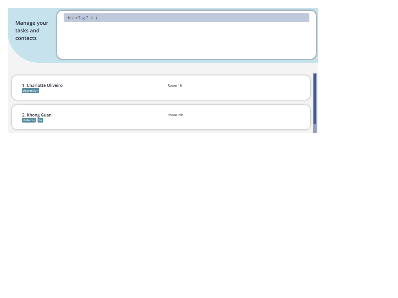
3. You can check that the `flu` tag is removed from Khong Guan.

    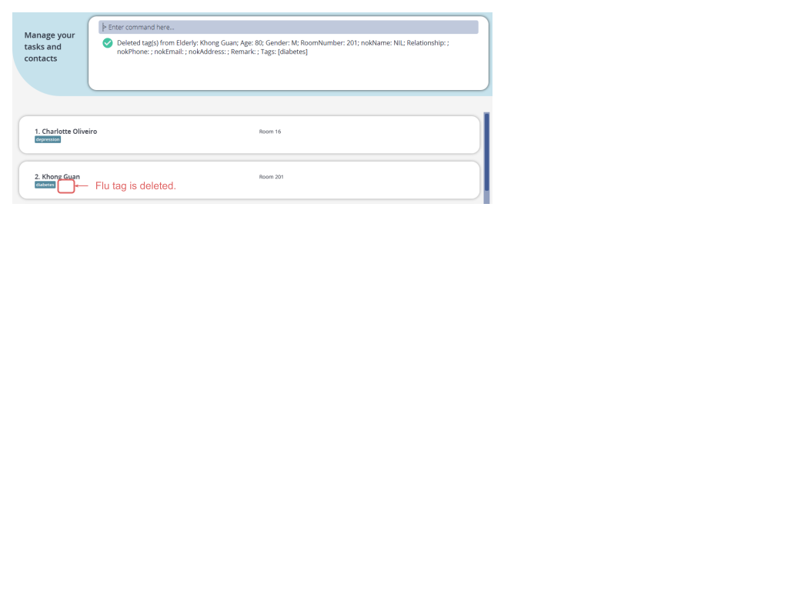

:information_source: **Information:**
* You must enter at least one tag.
* The deletion of tags is case-insensitive.
* Multiple tags that are the same or have different casing are treated as one tag. e.g. If you enter `t/Diabetic t/diabetic`, they will be taken as one tag which is the first one entered: `t/Diabetic`
* The index refers to the index number shown in the displayed elderly list.
* The index that you enter **must be a positive integer** 1, 2, 3, …​

#### 4.1.10 Filter elderly: `filter`

This command allows you to view a list of elderly with all the tags queried.

Format: `filter t/TAG [t/TAG]…​`

Example:

Let’s say you need to order food for the elderly you are taking care of. You need to know how many elderly require vegetarian meals. You have previously added the `vegetarian` tag to all elderly that are vegetarian. To get a list of elderly that are vegetarian, you can use the `filter` command!

To filter elderly based on tags:
1. Enter `filter t/vegetarian`
2. You can see a list of elderly with the `vegetarian` tag.

    

:information_source: **Information:**
* You must enter at least one tag.
* Only complete tags will be matched. e.g. `diab` will not match `diabetes`
* Multiple tags that are the same or have different casing are treated as one tag. e.g. If you enter `t/Diabetic t/diabetic`, they will be taken as one tag which is the first one entered: `t/Diabetic`
* Elderlies matching all tags will be returned (i.e._AND_ search). e.g. For `filter t/covid t/diabetes`, if the elderly only has the 'diabetes' tag, he will not be returned.
* The matching of tags is case-insensitive. e.g. You can enter `t/Diabetic` and it will match `diabetic`, `DIABETIC`

#### 4.1.11 Add remark to elderly: `remark`

This command allows you to add a remark to a specific elderly.

Format: `remark INDEX re/REMARK`

Example: 

Let’s say that you want to add a comment to Khong Guan, saying that the medicine given to him seems to be ineffective. You can add this comment to Khong Guan using a `Remark`. 

To add a remark to an elderly: 
1. Enter [`viewElderly`](#411-view-all-elderly-viewelderly) to view the list of elderly. 
2. Enter `remark 2 re/Medicine seems to be ineffective` to add the remark to Khong Guan. The index is 2 as Khong Guan is the second elderly in this list.
3. The remark “Medicine seems to be ineffective” will be added to Khong Guan. You can click on the elderly or use the [`viewDetails`](#416-view-full-details-of-an-elderly-viewdetails) command to see the remark.

    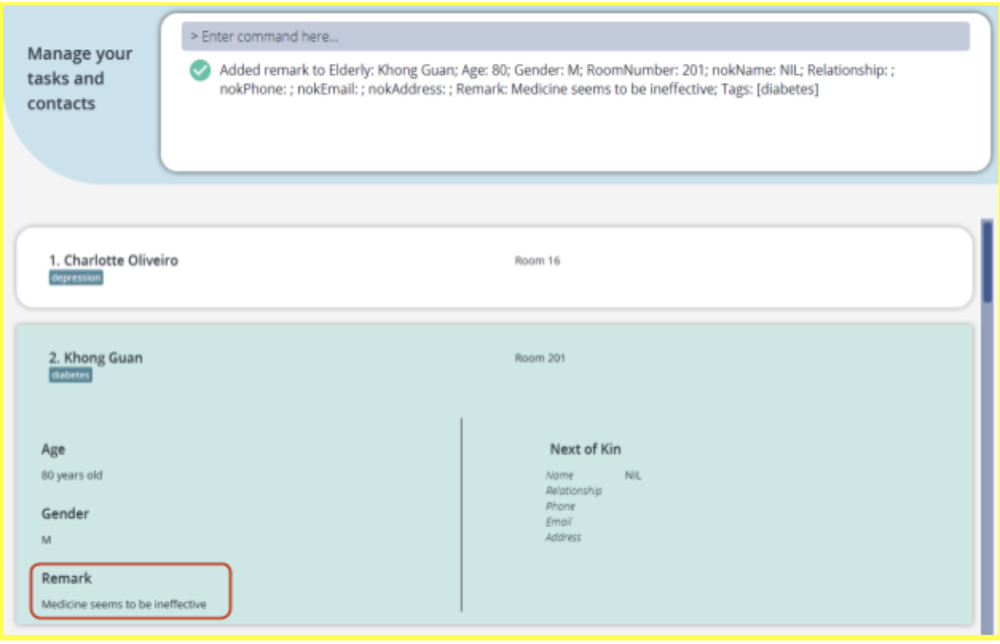

:information_source: **Information:**
* The index refers to the index number shown in the displayed elderly list.
* The index that you enter **must be a positive integer** 1, 2, 3, …​

:bulb: **Tip:**  

* You can remove a remark by leaving the remark input empty! e.g. [`viewElderly`](#411-view-all-elderly-viewelderly) followed by `remark 1 re/` or `remark 1` removes the remark for the 1st elderly in NurseyBook.

### 4.2 Task commands

#### 4.2.1 View all tasks: `viewTasks`

This command displays a list of all your tasks that you have added to NurseyBook.

Format: `viewTasks`

:exclamation: **Caution:**
* NurseyBook will not automatically refresh the displayed task list to reflect instantaneous changes, such as overdue tasks and new dates of recurring tasks. *Refer to the tips section [here](#422-add-a-task-addtask) to learn how to create recurring tasks.*
* However, you can manually trigger this refresh, and one way is to enter `viewTasks` in the command box.
* This will update the overdue status of all tasks and new dates of all recurring tasks.
    * e.g. If the time now is 9.01pm and there is an undone task which is due at 9.00pm the same day, you can enter `viewTasks`, otherwise the red overdue tag will not show automatically.
    * e.g. If the time now is 9.01pm and there is a recurring task due at 9.00pm, you can enter `viewTasks`, otherwise the task's date will remain unchanged.

:information_source: **Information:**

* The task list that you see is always sorted chronologically with the earliest tasks at the top.

#### 4.2.2 Add a task: `addTask`

This command lets you add a task to NurseyBook.

Format: `addTask [en/ELDERLY_NAME]…​ desc/DESCRIPTION date/DATE time/TIME [recur/RECURRENCE_TYPE]`

Example:

Let’s say you have a new weekly recurring task that starts on 25 January 2022. You have to check the insulin level of Khong Guan at 7.22pm. You can use the `addTask` command to add this task into NurseyBook.

To add a task:

1. Using the command `addTask`, enter the details accordingly:
   `addTask en/Khong Guan desc/check insulin level date/2022-01-25 time/19:22 recur/week`
2. This task will be added on to the task list in NurseyBook, which can be verified visually in the task list displayed.

    
    

:information_source: **Information:**

* Executing the command will automatically change the display view to your full task list, so that you can see the task you added.
* You can enter the name using a different letter case as the name of the existing elderly. e.g. `en/herman lim` is accepted if Herman Lim is a registered elderly.
* If you enter multiple of the same elderly name using the same/different casing, it will be treated as one elderly.
* You must enter the full name of the elderly so that the identity of the elderly is unambiguous.

:exclamation: **Caution:**
* If you want to add an elderly to the task, you need to first make sure that the elderly is already registered in your elderly database.

:bulb: **Tip:**

* You can add a recurring task to the list!  
  * There are a few recurring options available namely: `NONE`, `DAY`, `WEEK` and `MONTH` (4 weeks later from the previous date). Tasks that have passed their original date will have their date automatically updated to the new date based on the recurrence type of the task.
* If you want to create a non-recurring task, you can exclude the `recur` field. NurseyBook will automatically assume that the task is non-recurring.

#### 4.2.3 Delete a task: `deleteTask`

This command lets you delete a particular task from NurseyBook.

Format: `deleteTask INDEX`

Example:

Let’s say you have completed the task “Nurses Meeting” and you do not want that task to appear in NurseyBook anymore.

To delete a task:
1. Enter [`viewTasks`](#421-view-all-tasks-viewtasks) to display the current task list.

    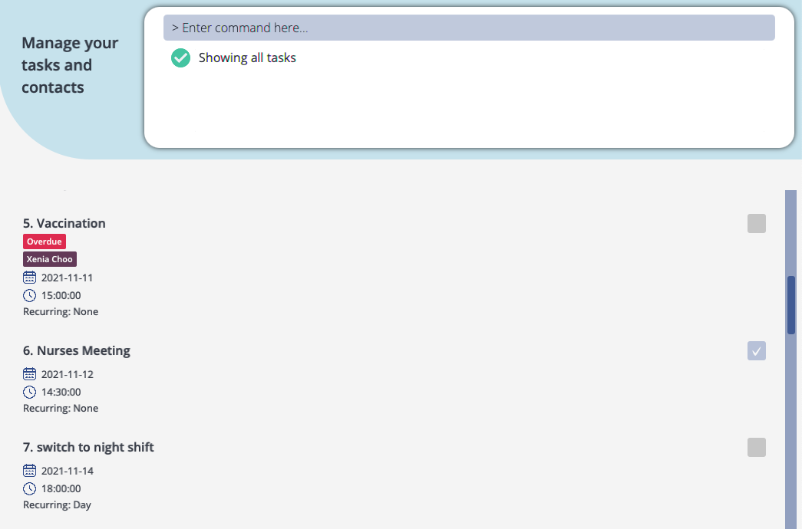

2. Assuming the task “Nurses Meeting” is the sixth task shown in the task list, enter `deleteTask 6`.
3. This task will be deleted and will disappear from NurseyBook.

    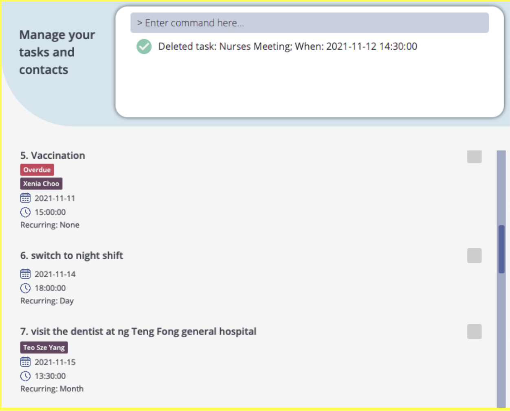

:information_source: **Information:**

* Deletes the task at the specified `INDEX`.
* The index refers to the index number shown in the displayed task list.
* The index that you enter **must be a positive integer** 1, 2, 3, …​

#### 4.2.4 Edit a task: `editTask`

This command lets you edit the details of a specific task.

Format: `editTask INDEX [en/ELDERLY_NAME]... [desc/DESCRIPTION] [date/DATE] [time/TIME] [recur/RECURRENCE_TYPE]`

Example:

Let’s say that you have realised that you had entered the wrong date for the “Physiotherapy" task that you have added earlier.

Instead of deleting the task and adding the task again with the updated date of 30 January 2022, you can easily edit that task's details by using the `editTask` command.

To edit a task:
1. Enter [`viewTasks`](#421-view-all-tasks-viewtasks) to display the current task list. In this case, as the “Physiotherapy” task has the index 11 number in the task list displayed, enter `editTask 11 date/2022-01-30`.

    

2. The result box will show the updated details of the task, with the task’s description, date, time and name(s) of elderly involved.

    

3. You can see that the details of the task have been changed. In this case, the date of the task is updated to 30 January 2022. As the date of the task has been pushed back, and the tasks in NurseyBook are ordered chronologically, the index of the task has increased.

    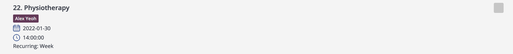

:information_source: **Information:**

* If you edit the date/recurrence type of a recurring task, the updated date generated will be based on the most recently edited date.
  
e.g. Date of task is `2022-01-01` with `daily` recurrence. On `2022-01-03`, the task is edited to be `weekly` recurring. When the next occurrence of the task is generated by NurseyBook, the date of the task will be `2022-01-10`.
* Multiple of the same elderly name in same/different casing will be treated as one elderly.
* The full name has to be entered so that the identity of the elderly is unambiguous.

:exclamation: **Caution:**
* If you want to edit the names of any elderlies linked to a task, you need to first make sure all the elderlies' names are already registered in your elderly database.

#### 4.2.5 Find a task: `findTask`

This command allows you to find tasks in NurseyBook whose description contains any of the entered keywords.

Format: `findTask KEYWORD [MORE_KEYWORDS]`

Example:

Let’s say you have forgotten when the meeting with the head nurse is going to be. Instead of manually scrolling past all of your tasks, you can find the task easily with the `findTask` command.

To find a task:

1. Ty

#### 4.2.5 Find a task: `findTask`

This command allows you to find tasks in NurseyBook whose description contains any of the entered keywords.

Format: `findTask KEYWORD [MORE_KEYWORDS]`

Example:

Let’s say you have forgotten when the meeting with the head nurse is going to be. Instead of manually scrolling past all of your tasks, you can find the task easily with the `findTask` command.

To find a task:

1. Enter `findTask` followed by the keyword you are searching for. For example, to look up the task with the description “Meeting with head nurse”, type in `findTask meeting`, and press `Enter` to execute it.
2. The result box will display the message with the number of tasks found. In this case, there are 3 tasks that contain the keyword “meeting”, thus “3 tasks listed!” is shown. You can see that all tasks whose description contains the word “meeting” are listed.

   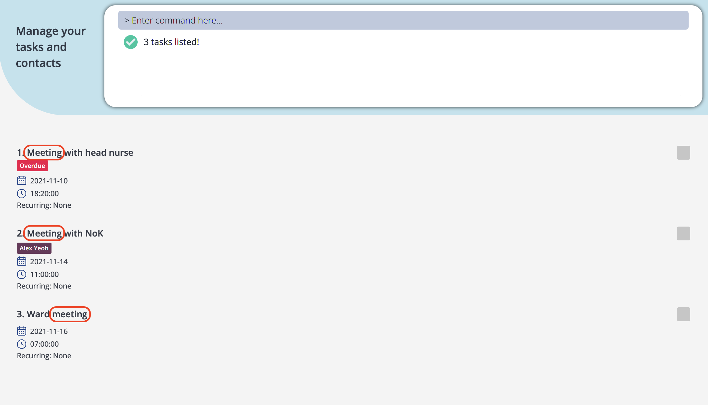

pe `findTask` followed by the keyword you are searching for. For example, to look up the task with the description “Meeting with head nurse”, type in `findTask meeting`, and press `Enter` to execute it.
2. The result box will display the message with the number of tasks found. In this case, there are 3 tasks that contain the keyword “meeting”, thus “3 tasks listed!” is shown. You can see that all tasks whose description contains the word “meeting” are listed.
   
   

:information_source: **Information:**

* The search is case-insensitive. e.g. `findTask meeting` returns the same tasks as `findTask Meeting`.
* You can use the `findTask` command with multiple keywords, as tasks whose description has at least one matching keyword will be shown. e.g. `findTask meeting walk` will show the tasks “Meeting with head nurse” and “go on a walk”.
* The order of the keywords you have entered does not matter. e.g. `findTask meeting walk` returns the same tasks as `findTask walk meeting`.
* Only the description of the tasks is searched.

#### 4.2.6 Mark a task as completed: `doneTask`

This command lets you mark an uncompleted task in NurseyBook’s task list as completed.

Format: `doneTask INDEX`

Example:

Let’s say Khong Guan’s medical check up with Dr Tan has just ended. To indicate this in NurseyBook to track your task completion progress, you can mark a task as completed with the `doneTask` command.

To mark a task as completed:

1. View your tasks either by entering the `viewTasks` or `findTask` command. For example, `findTask medical` is used in the image below to show all tasks in NurseyBook with the word “medical” in its description.
   
   

2. Enter `doneTask` into the command box, followed by the task’s index in the list displayed. In this case, as “Medical checkup with Dr Tan” with Khong Guan’s name has the index 1 in the list shown, the index should be 1. Press `Enter` to execute the command.
   
   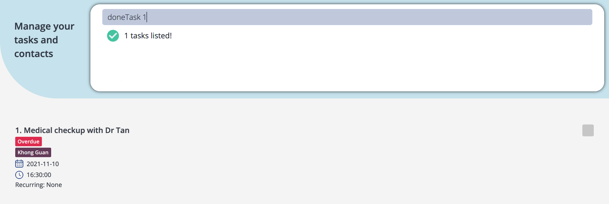
3. The result box will show that you have marked the task as done, with the task’s description, date, time and name(s) of elderly involved.

   
4. You can see that there is now a tick in the checkbox for the completed task, to indicate its completion status.

   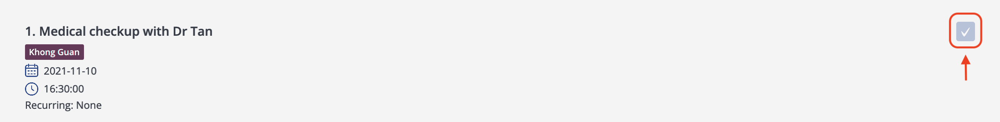

:information_source: **Information:**

* The index entered must be a positive integer (i.e. the number needs to be larger than zero), and should not be larger than the number of tasks in the displayed task list. For example, after entering `findTask walk`, there are 2 tasks in the list. So, only the numbers 1 and 2 are valid indices for this command.
* After you have marked an overdue task as completed, the overdue tag will no longer be displayed. For example, in the images above, you can see that the task “Medical checkup with Dr Tan” was originally overdue.
  
  After marking it as done, the task no longer has the overdue tag attached to it.

#### 4.2.7 View reminders: `remind`

This command will show you the list of uncompleted tasks in NurseyBook that are coming up within the next 3 days.

Format: `remind`

Example:

Let’s say your task list contains many: 
* Completed but not yet deleted tasks, or
* Overdue tasks 

Such tasks might be of a lower priority to you, as you want to view your upcoming tasks in the next few days.

Instead of scrolling past all the irrelevant tasks, you can use the `remind` command.

To view your upcoming tasks in the next few days:

1. Type `remind` in the command box, and press `Enter` to execute it.
2. The result box will display the message “Showing the tasks coming up in the next three days!”.
3. And you can see that tasks scheduled within the next 3 days will be shown.
   
   

:information_source: **Information:**

The `remind` command will only show you uncompleted tasks that are scheduled to happen within the next three days. 

For example, if it is 01 January today, the command will show you tasks on days 01, 02, 03 and 04 January. Tasks scheduled for 05 January and onwards will not be shown.

#### 4.2.8 View task schedule: `viewSchedule`

This command shows you the list of tasks in NurseyBook that are scheduled to occur on a specific date.

Format: `viewSchedule DATE`

Example:
Let’s say your colleague, Sally, wants to switch working shifts with you on 08 December. You usually work in the day shift, while she works in the afternoon shift. 

Before agreeing to her request, you want to make sure that you do not have many tasks scheduled for that day.

Instead of scrolling through your task list to locate the tasks occurring on the date, or checking manually if your recurring tasks will occur on the day too, you can use the `viewSchedule` command.

To view your schedule on a date:

1. Type in `viewSchedule` into the command box, followed by the date of enquiry. For example, you would like to find out your schedule on 08 December 2021. Your full command should be `viewSchedule 2021-12-08`. Press `Enter` to execute it.
   
   
2. The result box will display the message with the number of tasks occurring on the date. In this case, “5 tasks on indicated date!” is shown.
   
   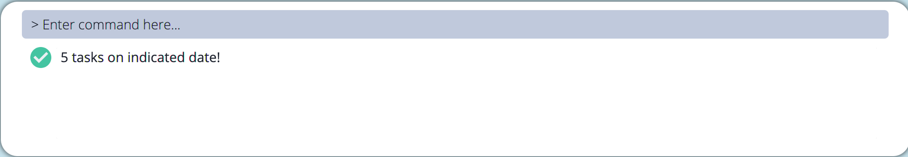
3. You can see that in the task list displayed, all tasks are scheduled to occur on 08 December 2021.
   
   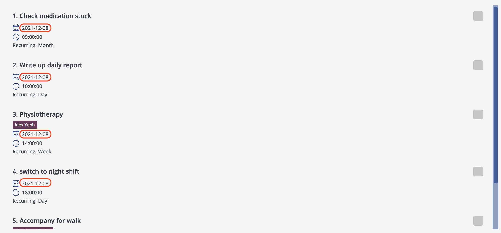

:information_source: **Information:**
* The date you enter must be in the form of yyyy-mm-dd.
* You can view your schedule for up to 12 weeks, or 84 days in advance from the current date. NurseyBook does not support viewing the schedule of days beyond this time frame, or days that have already passed.
* The `viewSchedule` command is simply a tool to preview future occurrences of recurring tasks. You cannot perform actions such as deleting, editing, marking such a task as completed.

  For example, the task “Write up daily report” is scheduled to happen on 04 December originally, and it is a recurring task that happens every day.
  
  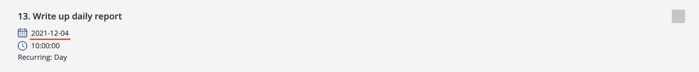

  If you execute viewSchedule 2021-12-08, you can see the future occurrence of this task.
  
  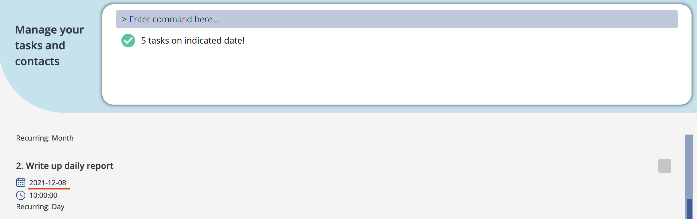

  If you try to delete this task, you will receive an error message.
  
  

  The future occurrences of the recurring tasks will be deleted from NurseyBook after you have entered any valid command into NurseyBook. For example, if you enter findTask report, the “Write up daily report” task on 08 December 2021 will not be shown.
  
  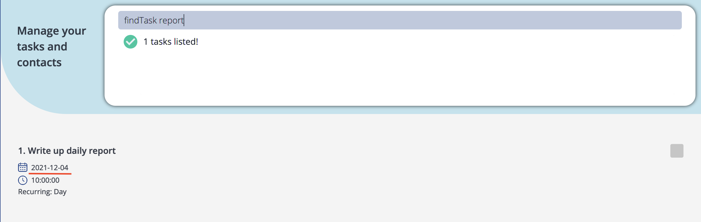

### 4.3 Miscellaneous commands

#### 4.3.1 Clearing all entries : `clear`

This command lets you clear all entries from NurseyBook. This can be used to give you a brand new NurseyBook in place of the old one.

Example: 

After you finish practicing commands on the sample data, you may want to clear the sample data with this command.

To clear:
1. Enter `clear` into the command box, and press `Enter` to execute it.
2. You should see your NurseyBook now become empty:
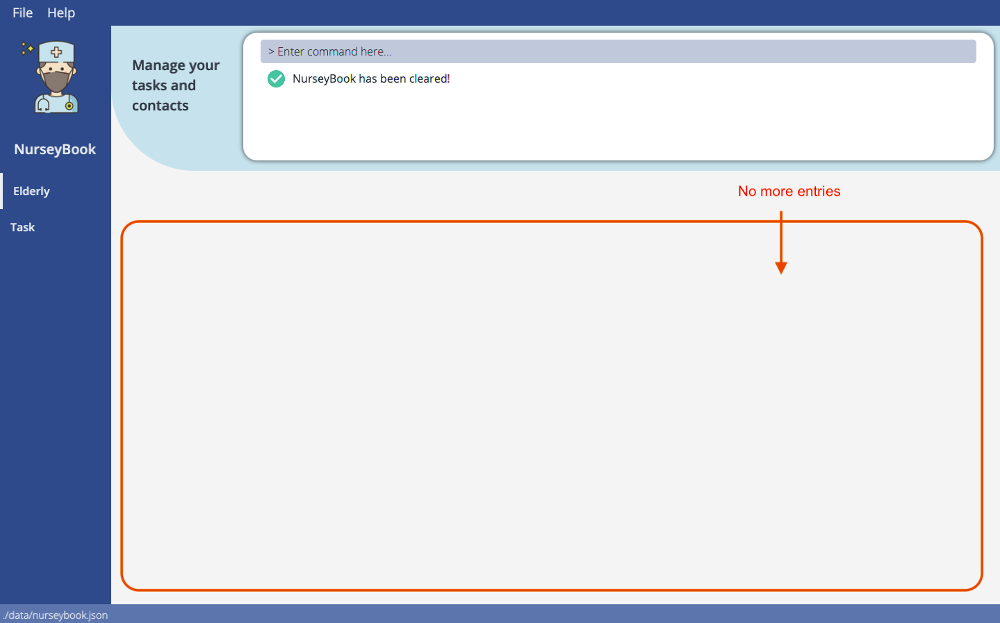

Format: `clear`

#### 4.3.2 Viewing help : `help`

This command shows you a summary of the commands (with the necessary command parameters) as well as a link to this user guide in a new window. You can copy the link by clicking the `Copy URL` button.

Format: `help`

:bulb: **Tip:**
* The help window is more optimized for viewing if you enter this command when NurseyBook is not in full screen mode.

#### 4.3.3 Undo previous command : `undo`

This command lets you undo your last command that modified NurseyBook’s data (i.e. adding/ editing/ deleting information to/from an elderly/task).

Format: `undo`

Example:
Let’s say that you have been entering elderly information into NurseyBook, and you accidentally deleted a contact (Khong Guan) from your list with `deleteElderly`!  
Instead of re-entering Khong Guan’s contact information all over again, you can easily restore all of his details by undo-ing the delete command you have just entered.

To undo:
1. Type `undo` into the command box, and press `Enter` to execute it. 
2. You can see Khong Guan’s contact reappear in the elderly list again.

:information_source: **Information:**

* Undoable commands (i.e. any command that modifies NurseyBook's data): `addElderly`, `editElderly`, `deleteElderly`, `deleteNok`, `addTag`, `deleteTag`, `remark`, `addTask`, `editTask`, `deleteTask`, `doneTask`, `clear`
* Non-undoable commands: `findElderly`, `filter`, `viewDetails`, `viewElderly`, `findTask`, `remind`, `viewTasks`, `viewSchedule`, `help`
* If you did not execute any undoable commands previously, the undo command will fail and an error message will be shown.
* If you undo a `deleteElderly` or an `editElderly` command, NurseyBook will restore the elderly's name in relevant tasks but the order of names may be different.

#### 4.3.4 Redo previously undone command : `redo`

This command lets you reverse your previous `undo` command.

Format: `redo`

Example: Let’s say that after you undo the `deleteElderly` command on Khong Guan, you decide that you want to remove his details after all.

To redo:
1. Enter `redo` in the command box and press `Enter` to execute it. 
2. You can see Khong Guan’s details is deleted again.

:information_source: **Information:**

* If you did not execute any `undo` commands previously, the `redo` command will fail and an error message will be shown.
* If you redo an `editElderly` command, it would restore the elderly's name in relevant tasks but the order of names may be different.

#### 4.3.5 Exiting the program : `exit`

This command allows you to exit the program.

Format: `exit`

--------------------------------------------------------------------------------------------------------------------

## 5. Storage

### 5.1 Saving the data

NurseyBook's data is saved in the hard disk automatically after any command that changes the data. There is no need for you to save the data manually.

### 5.2 Editing the data file

NurseyBook data is saved as a JSON file at `[JAR file location]/data/nurseybook.json`. If you are technologically savvy, you
are also welcome to update data directly by editing that data file.

:exclamation: **Caution:**
* If your changes to the data file makes its format invalid, NurseyBook will discard all data and start with an empty data file at the next run.
* This includes:
  * adding non-existent elderly names to tasks,
  * adding elderly names in a different case to tasks (e.g. Elderly `Khong Guan` within elderlies but a task's elderly names contain `khong guan`),
  * failing to remove/edit all instances of an elderly name you have deleted/edited within the tasks.

--------------------------------------------------------------------------------------------------------------------

## 6. FAQ

**Q**: How do I transfer my data to another Computer? 
**A**: Install the app on the other computer and overwrite the empty data file NurseyBook creates, with the NurseyBook data file from your computer.

--------------------------------------------------------------------------------------------------------------------

## 7. Command summary

### 7.1 Elderly

Action | Format, Examples
--------|------------------
**Add an elderly** | `addElderly en/ELDERLY_NAME a/AGE r/ROOMNO g/GENDER [t/TAG]…​ [nn/NOK_NAME] [rs/NOK_RELATIONSHIP] [p/NOK_PHONE_NUMBER] [e/NOK_EMAIL] [addr/NOK_ADDRESS]`     e.g., `addElderly en/Khong Guan a/80 g/M r/201 nn/Gong Kuan rs/Brother p/91234567 e/guanbro@gmail.com addr/London Street 11`
**Delete an elderly** | `deleteElderly INDEX`     e.g., `deleteElderly 3`
**Edit an elderly** | `editElderly INDEX [en/ELDERLY_NAME] [a/AGE] [g/GENDER] [r/ROOMNO] [t/TAG]…​ [nn/NOK_NAME] [rs/NOK_RELATIONSHIP] [p/NOK_PHONE_NUMBER] [e/NOK_EMAIL] [addr/NOK_ADDRESS] [re/REMARK]`
**Find an elderly** | `findElderly KEYWORD [MORE_KEYWORDS]`
**Delete next-of-kin of elderly** | `deleteNok INDEX`    e.g., `deleteNok 3`
**Add tag(s)** | `addTag INDEX t/TAG [t/TAG]…​`     e.g., `addTag 1 t/diabetes`
**Delete tag(s)** | `deleteTag INDEX t/TAG [t/TAG]…​`
**Filter** | `filter t/TAG [t/TAG]…​`
**Remark** | `remark INDEX re/REMARK`
**View elderly details** | `viewDetails INDEX`    e.g., `viewDetails 2`
**View all elderly** | `viewElderly`

### 7.2 Task

Action | Format, Examples
--------|------------------
**Add a task** | `addTask [en/ELDERLY_NAME] desc/DESCRIPTION date/DATE time/TIME [recur/RECURRENCE_TYPE]`     e.g., `addTask en/Alex Yeoh desc/check insulin level date/2022-01-25 time/10:00 recur/week`
**Delete a task** | `deleteTask INDEX`  e.g., `deleteTask 3`
**Edit a task** | `editTask INDEX [en/ELDERLY_NAME] [desc/DESCRIPTION] [date/DATE] [time/TIME] [recur/RECURRENCE_TYPE]`     e.g., `editTask 2 desc/Meeting with head nurse`
**Find a task** | `findTask KEYWORD [MORE_KEYWORDS]`
**Mark a task as complete** | `doneTask INDEX`  e.g., `doneTask 3`
**Remind** | `remind`
**View Schedule** | `viewSchedule DATE`   e.g., `viewSchedule 2022-02-14`
**View all tasks** | `viewTasks`

### 7.3 Miscellaneous

Action | Format, Examples
--------|------------------
**Clear** | `clear`
**Help** | `help`
**Undo** | `undo`
**Redo** | `redo`
**Exit** | `exit`

--------------------------------------------------------------------------------------------------------------------

## 8. Glossary

Term | Definition
--------|------------------
**Command Line Interface (CLI)** | Command line interface where users interact with the system by typing in commands.     e.g., Terminal
**JAR** | A file format that contains all bundled Java files (relevant to NurseyBook).
**Java 11** | The Java Platform, Standard Edition 11 Development Kit (JDK 11) is a feature release of the Java SE platform.
**Javascript Object Notation (JSON)** | JSON is a lightweight text format for storing and transporting data.            
**Case-insensitive** | Any letter case is acceptable (‘abc’ or ‘ABC’ are both acceptable).
**Displayed elderly/task list** | The list of elderlies/tasks displayed in NurseyBook’s application window.